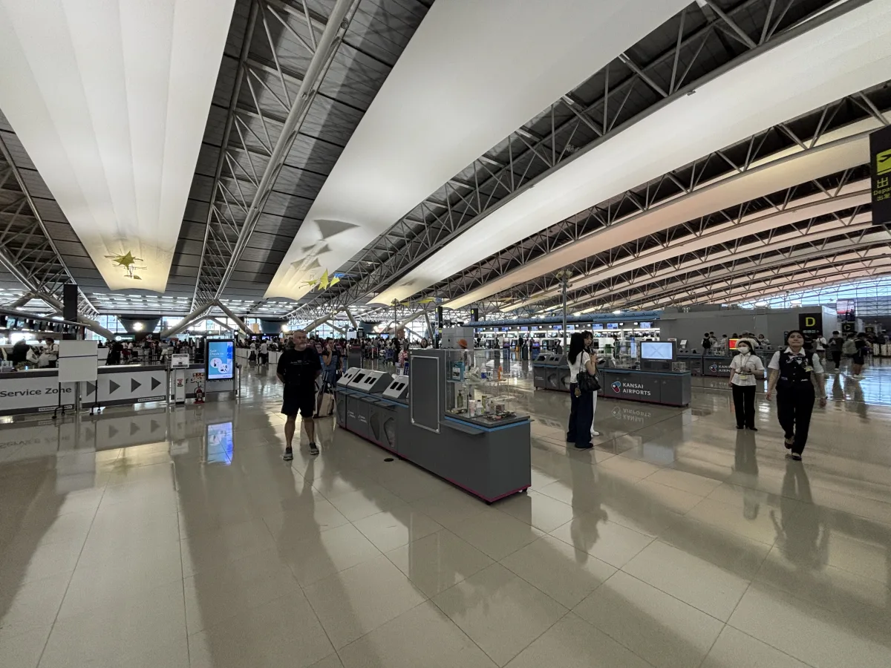
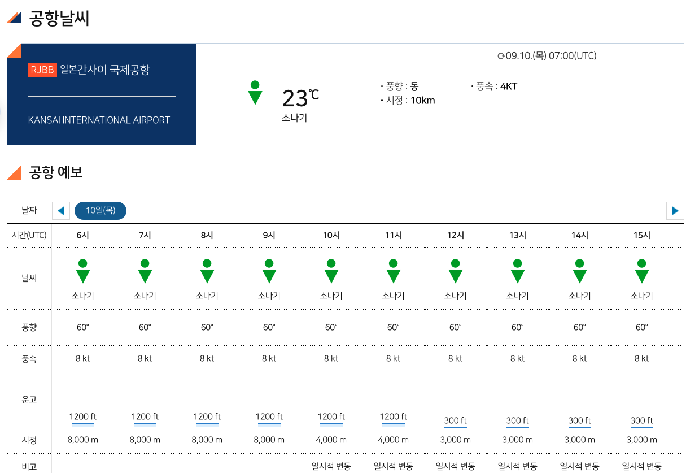
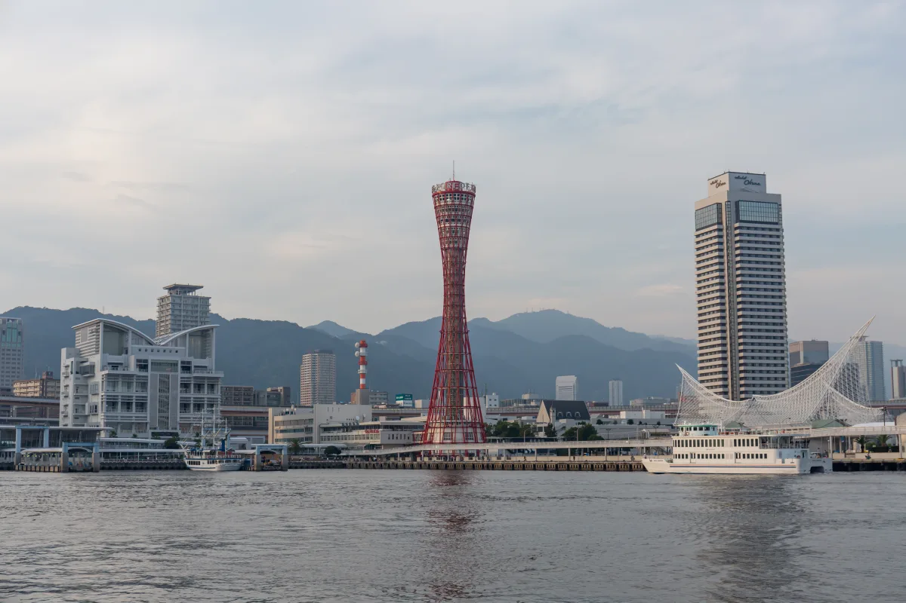
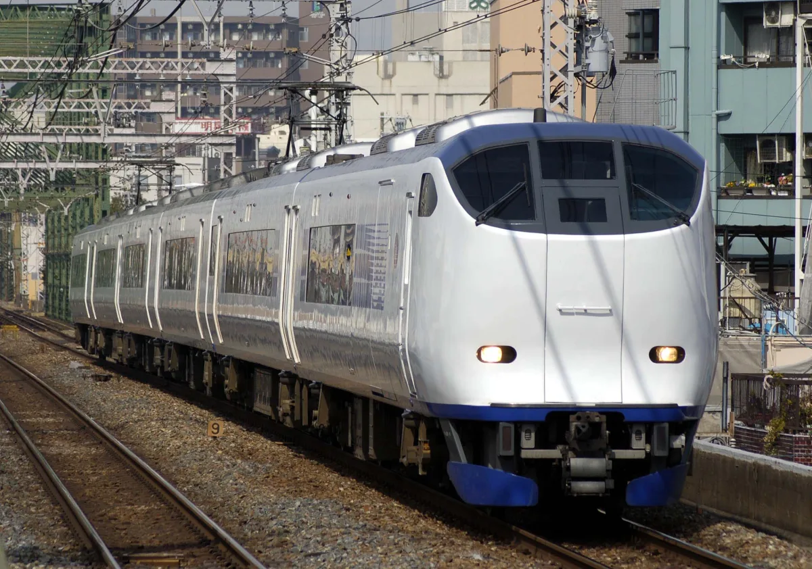

**간사이공항 현재날씨와 공항 예보는 항공기상청에서, 실제 지연·결항 여부는 이용 항공사와 간사이공항 공식 운항정보에서 확인하면 됩니다.** 오사카·교토·고베로 이동한다면 공항 기상과 여행할 지역의 예보를 따로 확인하세요.

여행 준비 중 공항 날씨를 찾다가 항공기상청에서 일본 공항별 기상정보도 제공한다는 것을 알게 됐습니다. 공항 날씨를 보고 나서 도착 후 여행할 지역의 예보도 찾아볼 수 있도록 필요한 사이트를 모았습니다.

## 간사이공항 날씨·운항정보 바로 확인

  <a href="https://amo.kma.go.kr/weather/airport.do?icaoCode=RJBB" target="_blank" rel="noopener noreferrer">간사이공항 현재날씨·예보 확인<small>항공기상청 · 새 창으로 이동</small>↗</a>
  <a href="https://www.kansai-airport.or.jp/kr/flight/search" target="_blank" rel="noopener noreferrer">간사이공항 출발·도착편 확인<small>공항 공식 운항정보 · 새 창으로 이동</small>↗</a>
  <a href="https://www.data.jma.go.jp/multi/yoho/kinki.html?forecast=weather0&amp;lang=kr" target="_blank" rel="noopener noreferrer">오사카·교토·고베 지역 예보 확인<small>일본 기상청 킨키 지방 · 한국어 · 새 창으로 이동</small>↗</a>

| 궁금한 내용 | 확인할 곳 | 먼저 볼 항목 |
|---|---|---|
| 지금 공항에 비가 오나? | 항공기상청 간사이공항 | 관측 시각·현재 기상 |
| 도착할 때 날씨는 어떨까? | 항공기상청 공항 예보 | 도착 시간대·풍속·시정 |
| 내 비행기가 지연됐나? | 이용 항공사·공항 운항정보 | 날짜·편명·출발/도착 구분 |
| 시내 관광 때 우산이 필요할까? | 일본 기상청 지역 예보 | 방문 지역·날짜·강수확률·기온 |

링크와 화면 구성은 **2026년 9월 10일** 기준입니다. 실시간 기온과 운항 상태는 이 글이 아닌 각 공식 페이지에서 확인하세요.

<small>간사이공항 제1터미널 출발층 · <a href="#photo-credits">사진: Fotointheworld</a></small>

## 항공기상청 화면에서는 시간부터 확인하세요

간사이공항은 항공권에서 **KIX**, 항공기상청 페이지에서는 **RJBB**로 표시됩니다. 페이지를 열면 공항 이름과 관측 시각부터 보세요. 현재 관측과 공항 예보는 나눠 읽어야 합니다.

**시간 옆에 UTC가 표시돼 있다면 한국·일본 시간으로는 9시간을 더해야 합니다.** 예를 들어 `02:00 UTC`는 같은 날 오전 11시입니다. `18:00 UTC`는 다음 날 오전 3시이므로 날짜도 함께 바뀝니다. 한국과 일본은 시차가 없습니다.

화면 출처: [항공기상청 간사이공항](https://amo.kma.go.kr/weather/airport.do?icaoCode=RJBB). **2026년 9월 10일 저장한 화면 예시이며 실시간 날씨가 아닙니다.**

현재 날씨가 맑아도 몇 시간 뒤 예보가 같다는 뜻은 아닙니다. 오늘 도착한다면 도착 시간대의 예보를, 며칠 뒤 여행한다면 여행지의 날짜별 예보를 먼저 보세요. 공항 예보에 아직 없는 날짜는 출발이 가까워졌을 때 다시 확인하면 됩니다.

풍속을 볼 때는 단위에 주의하세요. 화면의 `KT` 또는 `kt`는 노트입니다. 일반 날씨 앱의 `m/s`와 숫자를 그대로 비교하면 안 됩니다. 시정은 앞을 볼 수 있는 거리, 운고는 구름의 높이를 살피는 항목입니다. 이 수치만으로 내 항공편의 운항 여부를 판단하지는 마세요.

## 간사이공항 결항 여부는 날씨와 별도로 확인

강풍이나 비 예보가 있다면 **내 편명으로 운항 상태를 확인하세요.** 풍속 숫자 하나만으로 예약편의 결항 여부를 판단하기는 어렵습니다. 날씨 정보만으로 운항 여부를 판단할 수 없으므로 항공사 안내를 확인하세요.

1. 항공권에서 날짜와 편명을 확인합니다.
2. 한국에서 간사이로 가는 날은 공항 사이트의 **도착편**, 간사이에서 귀국하는 날은 **출발편**을 확인합니다.
3. 예약한 항공사 앱·홈페이지의 운항 상태와 알림을 함께 확인합니다.
4. 지연이 표시되면 변경된 도착 시각을 기준으로 시내 교통편과 숙소 체크인 시간을 다시 살펴봅니다.

간사이공항은 기상 등으로 운항이 바뀌어도 안내 화면에 바로 반영되지 않을 수 있다고 안내합니다. 표시가 다르거나 판단이 어렵다면 이용 항공사에 문의하세요. [간사이공항 공식 운항정보 및 이용 시 유의사항](https://www.kansai-airport.or.jp/kr/flight/search)

## 오사카·교토·고베 날씨는 어디를 보면 될까?

간사이공항 날씨를 봤다면 **숙박하거나 관광할 지역의 예보**도 살펴보세요. 공항 공식 안내에 따르면 간사이공항은 오사카 시가지에서 약 50km 떨어져 있습니다. 공항이 맑다고 시내나 다른 도시의 날씨까지 같지는 않습니다. [간사이공항 교통 안내](https://www.kansai-airport.or.jp/kr/access/from-airport)

[일본 기상청 한국어 일기 예보](https://www.data.jma.go.jp/multi/yoho/kinki.html?forecast=weather0&lang=kr)에서 **킨키 지방**을 기준으로 여행할 지역을 확인하세요. 교토는 화면에 `쿄토부`, 고베가 있는 지역은 `효고 현`으로 표기됩니다.

| 여행 일정 | 확인할 지역 | 일정에 적용할 기준 |
|---|---|---|
| 난바·우메다 등 오사카 시내 | 오사카부, 오사카 | 도착 당일과 시내 관광일을 구분 |
| 교토 시내 관광 | 쿄토부, 교토 | 오사카 숙박일보다 교토 방문일 예보를 확인 |
| 고베 시내·항구 주변 | 효고 현, 고베 | 고베를 방문하는 시간대의 비·바람을 확인 |
| 여러 도시를 이동 | 각 방문 지역 | 여행 전체를 한 도시의 예보로 대신하지 않기 |

교토부나 효고현 전체 예보를 볼 때는 관광할 시내가 어느 예보 구역에 속하는지도 살펴보세요. 같은 부·현 안에서도 북부와 남부처럼 예보 구역이 나뉠 수 있습니다.

예를 들어 오사카에서 숙박하고 다음 날 교토로 이동한다면 오늘 오사카와 내일 교토의 예보를 각각 보면 됩니다. 월평균 기온은 짐을 꾸릴 때 참고할 수 있지만 특정 여행일의 강수 예보를 대신하지는 못합니다.

### 오사카 도톤보리·난바를 걷는 날 {#오사카-도톤보리난바를-걷는-날}

<small>오사카 도톤보리 · <a href="#photo-credits">사진: Oilstreet</a></small>

도톤보리·난바를 걷는 날에는 **오사카 시내 예보**를 봅니다. 비가 오는 시간에 맞춰 산책과 실내 식사·쇼핑 순서를 바꿀 수 있도록 일정을 여유 있게 잡으세요. 숙소에서 목적지까지 걸어갈 구간도 살펴두면 좋습니다.

[오사카부 예보 보기 · 일본 기상청, 일본어](https://www.jma.go.jp/bosai/forecast/#area_type=offices&area_code=270000). 날짜별 강수확률과 `大阪`의 기온을 확인하세요.

  
<strong>오사카 관광 패스를 알아보고 있다면</strong> · 클룩 제휴

  
방문할 시설을 정한 뒤 패스별 포함 시설과 교통 혜택을 비교하세요. 비 때문에 일정을 바꿀 수 있다면 시설 운영 여부와 티켓 취소·변경 조건도 살펴보세요.

  <a href="https://3ha.in/r/697612" target="_blank" rel="sponsored nofollow noopener noreferrer">오사카 주유패스·E-패스 가격과 이용 조건 보기 ↗</a>

### 교토는 방문하는 날의 예보 확인 {#교토-방문-날짜의-예보를-따로-확인}

<small>교토 기요미즈데라 · <a href="#photo-credits">사진: Jordy Meow</a></small>

오사카에서 숙박하더라도 교토에 가는 날은 **교토 지역 예보**를 봐야 합니다. 기요미즈데라처럼 야외를 둘러볼 때는 이동과 관람에 걸리는 시간도 생각해 두세요. 그 시간대에 비가 오는지 살펴보면 됩니다.

[교토부 예보 보기 · 일본 기상청, 일본어](https://www.jma.go.jp/bosai/forecast/#area_type=offices&area_code=260000). 교토 시내 일정은 `南部`(남부)의 예보와 `京都`의 기온을 보세요.

### 고베항 산책 전에는 비와 바람 확인 {#고베-항구-산책-전에는-비와-바람-함께-보기}

<small>고베항 · <a href="#photo-credits">사진: Balon Greyjoy</a></small>

고베항 주변을 걷거나 야경을 볼 계획이라면 **고베를 방문할 시간대의 예보**에서 비와 바람을 살펴보세요. 날씨가 좋지 않아 산책을 줄이더라도 곤란하지 않도록 식사 장소와 돌아가는 교통편은 미리 알아두면 좋습니다.

[효고현 예보 보기 · 일본 기상청, 일본어](https://www.jma.go.jp/bosai/forecast/#area_type=offices&area_code=280000). 고베 시내 일정은 `南部`(남부)의 예보와 `神戸`의 기온을 보세요.

### 곧 외출한다면 비구름도 함께 확인

하루 예보에 비 표시가 있어도 하루 종일 같은 강도로 내리지는 않습니다. 외출 전에는 [일본 기상청 비구름의 움직임](https://www.jma.go.jp/bosai/multi_nowc/?lang=kr)에서 현재 위치와 이동할 방향을 살펴보세요. 지도가 어느 시각의 정보인지 보고 여행 지역이 작게 보이면 확대합니다.

태풍이나 호우가 걱정되는 날은 [기상 경보·주의보](https://www.data.jma.go.jp/multi/warn/index.html?lang=kr)와 [태풍 정보](https://www.data.jma.go.jp/multi/cyclone/index.html?lang=kr)도 확인하세요. 경보가 발표되거나 교통기관이 운휴를 안내했다면 야외 일정과 이동 계획부터 다시 살펴봐야 합니다.

## 비 예보가 있을 때 이동·숙소·준비물 점검

### 공항에서 숙소까지, 마지막 도보 구간까지 보기

<small>JR 하루카 · <a href="#photo-credits">사진: Sui-setz</a></small>

비가 오는 날에는 공항에서 출발해 내릴 역만 정하지 말고 **역에서 숙소까지 얼마나 걸어야 하는지**도 보세요. 캐리어가 있다면 환승 횟수, 엘리베이터가 있는 출구, 숙소까지의 도보 구간을 함께 비교하면 좋습니다.

[간사이공항 공식 교통 안내](https://www.kansai-airport.or.jp/kr/access/from-airport)에 전철·버스 등 이동 수단이 정리돼 있습니다. 기상 악화가 예상되면 시간표 외에 이용할 교통기관의 운행 공지도 보세요. 항공편 운항과 시내 교통편 운행은 별도로 살펴봐야 합니다.

  
<strong>공항 교통편 티켓 확인</strong> · 클룩 제휴

  
숙소에서 가까운 도착역·정류장과 이용 시간을 먼저 정한 뒤 티켓을 고르세요. 항공편 지연에 대비해 유효기간, 교환 방법, 취소·변경 조건도 확인하는 편이 좋습니다.

  <a href="https://3ha.in/r/697611" target="_blank" rel="sponsored nofollow noopener noreferrer">JR 하루카 공항 특급열차 편도 티켓 보기 ↗</a>
  <a href="https://3ha.in/r/696213" target="_blank" rel="sponsored nofollow noopener noreferrer">오사카–간사이공항 리무진버스 티켓 보기 ↗</a>
  
티켓 판매 여부와 실제 운행 여부는 다릅니다. 악천후에는 구매 전 운행 공지를 확인하세요.

### 늦은 도착·이른 출발이라면 숙박 위치 비교

숙소를 아직 정하지 않았다면 아래 기준으로 비교해 보세요. 이미 예약했다면 새 숙소를 찾기 전에 기존 숙소의 체크인 가능 시간과 예약 변경 조건부터 살펴보세요.

| 상황 | 숙소를 고를 때 먼저 볼 것 |
|---|---|
| 늦은 밤 간사이 도착 | 입국·수하물 수령 후 이용 가능한 교통편과 최종 체크인 시간 |
| 다음 날 이른 귀국편 | 이용 터미널까지 첫차·셔틀로 도착 가능한지 |
| 비 예보에 짐이 많음 | 역·정류장에서 숙소까지 거리와 계단·환승 부담 |
| 공항 주변 숙소 검토 | 지도상 거리보다 실제 이동 수단과 셔틀 시간·예약 조건 |

공항 근처라는 설명만으로 새벽 이동이 해결되는 것은 아닙니다. 셔틀이 있다면 출발 시간, 이용 터미널, 사전 예약 여부를 숙소 공식 안내에서 확인하세요.

### 비 오는 여행 준비물은 필요한 것만

<small>비 오는 교토 골목 · <a href="#photo-credits">사진: Tom Maisey</a></small>

| 준비물 | 고려할 상황 | 고를 때 확인할 점 |
|---|---|---|
| 접이식 우산 | 시내 도보 이동이 있는 일정 | 무게·접었을 때 크기·젖은 우산 보관 |
| 방수 파우치 | 여권·서류를 다른 짐과 분리할 때 | 수납 크기·잠금 방식·방수 성능 표시 |
| 캐리어 커버 | 비를 맞으며 짐을 옮길 구간이 있을 때 | 캐리어 규격·바퀴와 손잡이 사용 편의 |
| 여벌 양말·젖은 물건용 봉투 | 장시간 걷거나 숙소 이동이 있는 날 | 기존 준비물로 대체 가능한지 |

새로 사기 전에 집에 있는 물건으로 충분한지 살펴보세요. 강풍·호우 때는 우산이나 방수용품을 챙기는 것보다 외출과 이동 일정을 조정하는 일이 먼저입니다.

## 다른 일본 공항 날씨도 확인하려면

나리타·하네다·후쿠오카 등 다른 공항을 이용하거나 입국·출국 공항이 다르다면 일본 공항별 날씨 전체 목록에서 찾아보세요. 각 공항의 항공기상청 페이지로 바로 연결됩니다.

<a class="kix-guide-related" href="/posts/일본-공항-날씨-항공기상청-바로가기/">
  <strong>일본 공항별 날씨 전체 목록 보기｜나리타·하네다·후쿠오카 등</strong>
  
</a>

## FAQ

### 간사이공항 현재날씨는 어디서 확인하나요?

[항공기상청 간사이공항 페이지](https://amo.kma.go.kr/weather/airport.do?icaoCode=RJBB)에서 확인할 수 있습니다. 공항 이름과 관측 시각부터 보세요. 도착할 때의 날씨가 궁금하다면 공항 예보에서 해당 시간대를 찾으면 됩니다.

### 간사이공항 풍속이 어느 정도면 결항인가요?

풍속 숫자 하나만으로 예약편의 결항 여부를 판단하기는 어렵습니다. 예약편의 운항 상태를 항공사와 공항 공식 안내에서 확인하세요.

### 간사이공항 날씨를 오사카 여행 날씨로 봐도 되나요?

공항 날씨는 공항 주변의 상태를 보여줍니다. 시내 일정에는 오사카 예보를 따로 보세요. 교토·고베에 가는 날은 해당 지역의 예보가 필요합니다.

### 항공기상청 예보 시간이 항공권과 달라 보이는 이유는 뭔가요?

UTC 표시가 있는지 확인하세요. UTC에는 9시간을 더하면 한국·일본 시간이 됩니다. 날짜가 다음 날로 넘어가는 경우도 있으므로 시간만 비교하지 마세요.

### 비 예보가 있으면 공항 근처 숙소를 잡아야 하나요?

비 예보만으로 숙소를 바꿀 필요는 없습니다. 실제 도착 시각, 시내 교통편, 체크인 가능 시간, 다음 날 일정을 함께 비교하세요. 기존 예약이 있다면 취소·변경 조건도 먼저 확인해야 합니다.

## 참고 자료

  <a href="https://amo.kma.go.kr/weather/airport.do?icaoCode=RJBB" target="_blank" rel="noopener noreferrer" style="display:block;padding:14px 16px;border-bottom:1px solid #374151;color:#f9fafb;text-decoration:underline;">항공기상청 간사이공항 · 현재 기상과 공항 예보 ↗</a>
  <a href="https://www.kansai-airport.or.jp/kr/flight/search" target="_blank" rel="noopener noreferrer" style="display:block;padding:14px 16px;border-bottom:1px solid #374151;color:#f9fafb;text-decoration:underline;">간사이공항 · 공식 운항정보와 이용 시 유의사항 ↗</a>
  <a href="https://www.data.jma.go.jp/multi/yoho/kinki.html?forecast=weather0&amp;lang=kr" target="_blank" rel="noopener noreferrer" style="display:block;padding:14px 16px;border-bottom:1px solid #374151;color:#f9fafb;text-decoration:underline;">일본 기상청 · 킨키 지방 일기 예보 ↗</a>
  <a href="https://www.data.jma.go.jp/multi/index.html?lang=kr" target="_blank" rel="noopener noreferrer" style="display:block;padding:14px 16px;border-bottom:1px solid #374151;color:#f9fafb;text-decoration:underline;">일본 기상청 · 한국어 기상·재난 정보 ↗</a>
  <a href="https://www.kansai-airport.or.jp/kr/access/from-airport" target="_blank" rel="noopener noreferrer" style="display:block;padding:14px 16px;color:#f9fafb;text-decoration:underline;">간사이공항 · 전철·버스 등 교통 안내 ↗</a>

<strong>사진 출처</strong>

지역·시설 소개용 사진으로, 현재 날씨나 운항 상태와는 다릅니다. 게재를 위해 크기·파일 형식을 변경했습니다.

- **간사이공항:** [Fotointheworld](https://commons.wikimedia.org/wiki/File:Kansai_Airport_Terminal_1_Departure_2025.JPG) · [CC BY 4.0](https://creativecommons.org/licenses/by/4.0/)
- **하루카:** [Sui-setz](https://commons.wikimedia.org/wiki/File:JR_West_281_Haruka.jpg) · 퍼블릭 도메인
- **교토 골목:** [Tom Maisey](https://commons.wikimedia.org/wiki/File:Rainy_street,_Kyoto_(16683855248).jpg) · [CC BY 2.0](https://creativecommons.org/licenses/by/2.0/)
- **도톤보리:** [Oilstreet](https://commons.wikimedia.org/wiki/File:Dotonbori_Osaka_Japan01-r.jpg) · [CC BY 2.5](https://creativecommons.org/licenses/by/2.5/)
- **기요미즈데라:** [Jordy Meow](https://commons.wikimedia.org/wiki/File:Kiyomizu.jpg) · [CC BY-SA 3.0](https://creativecommons.org/licenses/by-sa/3.0/) (같은 라이선스로 제공)
- **고베항:** [Balon Greyjoy](https://commons.wikimedia.org/wiki/File:20190901_Kobe_harbor-2.jpg) · [CC0 1.0](https://creativecommons.org/publicdomain/zero/1.0/)

## 여행 준비에 필요한 다른 가이드

<a class="kix-guide-related" href="/posts/일본-여행-도움-되는-사이트-모음/">
  <strong>일본 여행 사이트 모음｜Visit Japan Web·교통·날씨·공항 준비</strong>
  
</a>
