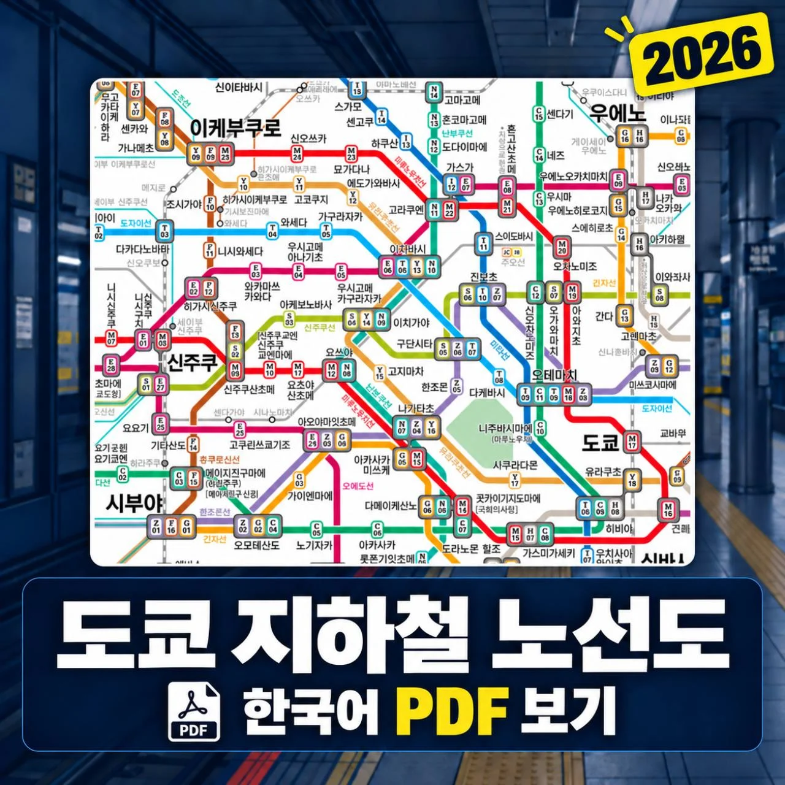
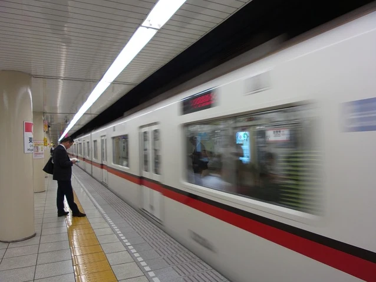
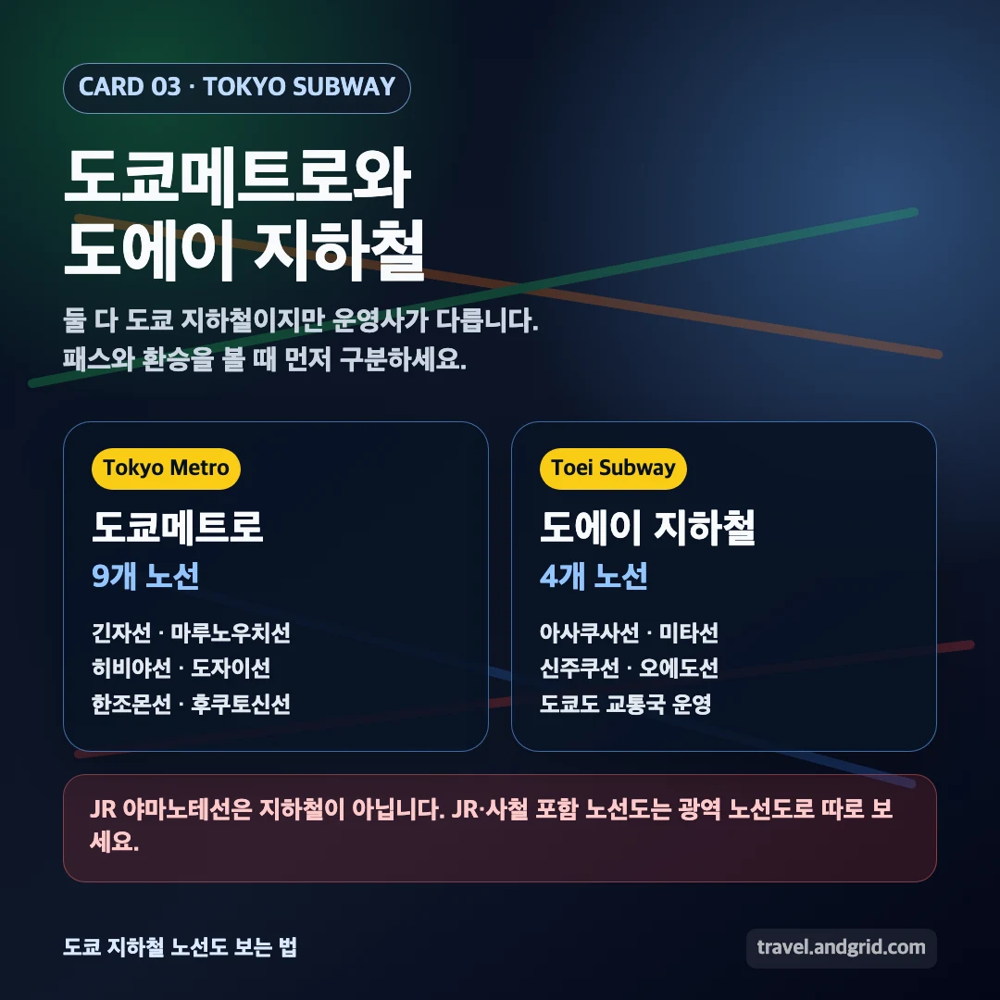
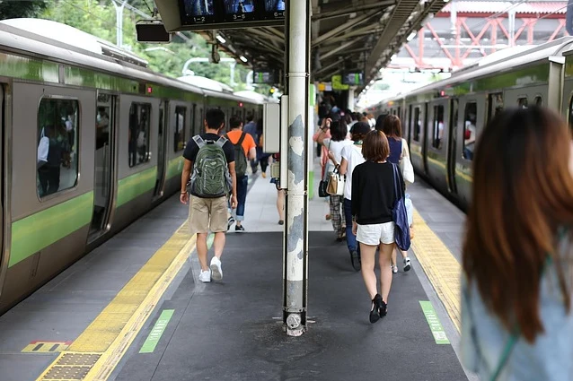
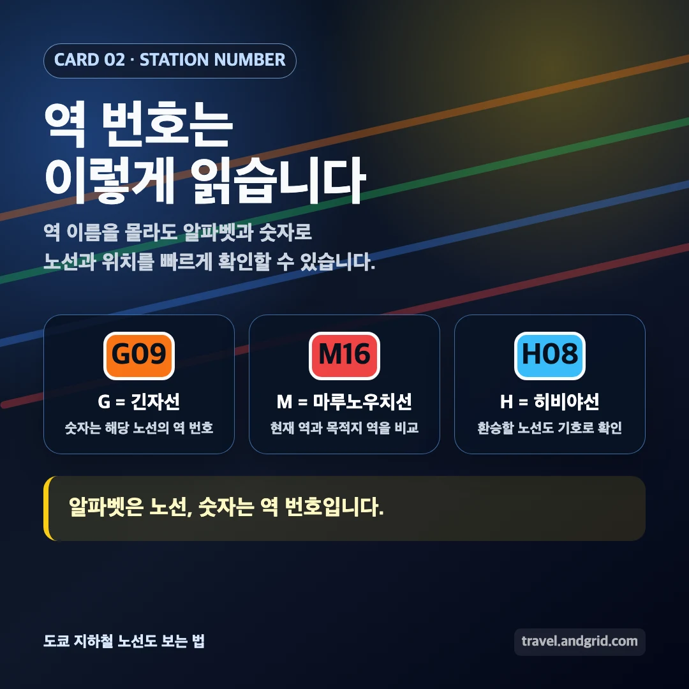
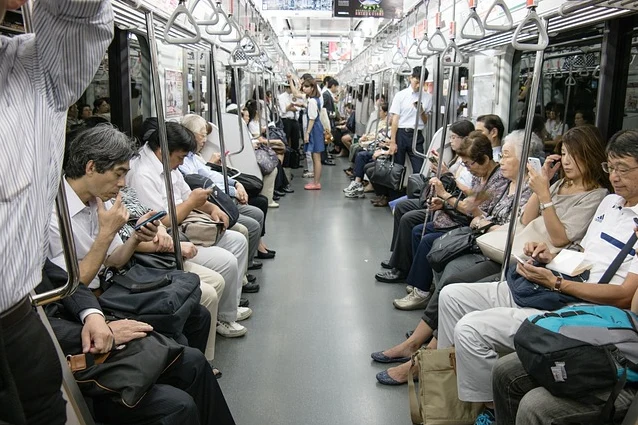
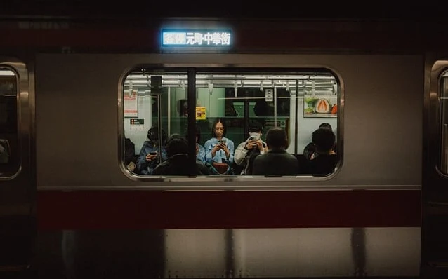

도쿄 지하철 노선도는 처음 보면 선이 많아서 복잡해 보입니다. 그래도 여행자가 먼저 볼 부분은 생각보다 단순합니다. `도쿄메트로`, `도에이 지하철`, `JR`, `사철`이 서로 다르다는 점을 구분하고, 노선 색깔과 역 번호를 같이 보면 훨씬 쉽게 읽을 수 있습니다.

이 글에서는 2026년 도쿄 여행을 준비할 때 확인할 도쿄 지하철 노선도 한글 다운로드 페이지, 영어판 노선도, JR 포함 노선도와 지하철 전용 노선도의 차이, 그리고 처음 도쿄 지하철을 탈 때 헷갈리기 쉬운 환승 보는 법을 정리했습니다. 제목의 `JR 포함`은 공식 한글 노선도에 JR 노선이 모두 포함된다는 뜻이 아니라, 지하철 노선도와 JR 포함 전체 이동을 어떻게 나눠 봐야 하는지 함께 설명한다는 의미입니다.

## 한 줄 답변

2026년 도쿄 지하철 노선도 한글 자료는 도쿄메트로 공식 페이지에서 확인할 수 있습니다. 다만 이 노선도는 도쿄메트로와 도에이 지하철 중심으로 보는 자료이므로, JR 야마노테선이나 사철까지 포함한 전체 이동은 별도 노선도나 지도 앱을 함께 보는 것이 좋습니다.

## 도쿄 지하철 노선도 2026 한글 PDF 다운로드

도쿄메트로는 도쿄 지하철 노선도 페이지에서 한국어 노선도와 PDF 다운로드를 안내합니다. 한글판으로 전체 구조를 먼저 보고, 현지에서 영어 역명이나 로마자 표기가 필요할 때는 영어판도 함께 열어두면 편합니다.

  <a href="https://www.tokyometro.jp/kr/subwaymap/index.html" target="_blank" rel="noopener noreferrer" style="display:grid;grid-template-columns:1fr auto;gap:12px;padding:14px 16px;border-bottom:1px solid #374151;color:#f9fafb;text-decoration:none;">
    
      <strong style="display:block;color:#f9fafb;">도쿄메트로 한국어 노선도 다운로드</strong>
      한국어 노선도와 PDF 다운로드 확인
    
    ↗
  </a>
  <a href="https://www.tokyometro.jp/en/subwaymap/index.html" target="_blank" rel="noopener noreferrer" style="display:grid;grid-template-columns:1fr auto;gap:12px;padding:14px 16px;color:#f9fafb;text-decoration:none;">
    
      <strong style="display:block;color:#f9fafb;">Tokyo Metro English Subway Map</strong>
      영어 노선도와 PDF 다운로드 확인
    
    ↗
  </a>

한글 PDF만 저장해도 기본적인 여행에는 충분합니다. 다만 현지 안내판은 일본어와 영어 표기가 더 크게 보이는 경우가 많습니다. 그래서 한글판으로 구조를 이해하고, 영어판으로 실제 역명 표기를 대조하는 방식이 가장 편합니다.

PDF가 바로 열리지 않거나 최신 자료인지 확인하고 싶다면 도쿄메트로 공식 노선도 페이지에서 다시 확인하면 됩니다. 검색 결과에 떠 있는 오래된 이미지나 블로그 캡처보다 공식 페이지를 기준으로 보는 편이 안전합니다.

노선과 환승 경로를 직접 검색하고 싶다면 도쿄메트로와 도쿄도 교통국 홈페이지를 함께 보면 됩니다. 도쿄메트로는 지하철 노선도, 역 정보, 운임·환승 검색을 확인하기 좋고, 도쿄도 교통국은 도에이 지하철과 도에이 교통 정보를 볼 때 유용합니다.

  <a href="https://www.tokyometro.jp/kr/index.html" target="_blank" rel="noopener noreferrer" style="display:grid;grid-template-columns:1fr auto;gap:12px;padding:14px 16px;border-bottom:1px solid #374151;color:#f9fafb;text-decoration:none;">
    
      <strong style="display:block;color:#f9fafb;">도쿄메트로 한국어 홈페이지</strong>
      도쿄메트로 노선도, 역 정보, 운임·환승 검색 확인
    
    ↗
  </a>
  <a href="https://www.kotsu.metro.tokyo.jp/kor/" target="_blank" rel="noopener noreferrer" style="display:grid;grid-template-columns:1fr auto;gap:12px;padding:14px 16px;color:#f9fafb;text-decoration:none;">
    
      <strong style="display:block;color:#f9fafb;">도쿄도 교통국 한국어 홈페이지</strong>
      도에이 지하철과 도쿄도 교통 정보 확인
    
    ↗
  </a>

## 도쿄 지하철 노선도에서 먼저 구분할 것

도쿄 교통이 복잡해 보이는 가장 큰 이유는 운영 회사가 여러 개이기 때문입니다. 도쿄 지하철은 도쿄메트로와 도에이 지하철을 합쳐 13개 노선으로 보는 경우가 많고, 도쿄 관광 공식 안내에서는 280개가 넘는 역을 커버하는 지하철망으로 설명합니다. 여행자는 아래 네 가지를 먼저 구분하면 됩니다.

| 구분 | 대표 예시 | 여행자가 알아둘 점 |
|---|---|---|
| 도쿄메트로 | 긴자선, 마루노우치선, 히비야선 등 | 9개 노선, 180개 역 규모의 도쿄 지하철 중심 운영사 |
| 도에이 지하철 | 아사쿠사선, 미타선, 신주쿠선, 오에도선 | 4개 노선, 106개 역 규모의 도쿄도 교통국 운영 지하철 |
| JR | 야마노테선, 주오선 등 | 지하철은 아니지만 도쿄 여행에서 자주 탐 |
| 사철·공항철도 | 게이세이, 게이큐, 도큐, 오다큐 등 | 공항 이동이나 근교 이동에서 자주 연결됨 |

도쿄메트로 PDF를 보고 있다고 해서 JR까지 전부 포함된 것은 아닙니다. 반대로 JR이 포함된 전체 철도 노선도는 지하철만 보는 지도보다 훨씬 복잡할 수 있습니다. 그래서 처음에는 지하철 전용 노선도로 구조를 보고, 실제 이동 경로는 지도 앱으로 확인하는 편이 좋습니다.

## JR 포함 노선도와 지하철 노선도는 다르다

검색어에 `도쿄 지하철 노선도 JR`이 같이 붙는 경우가 많습니다. 실제 여행에서는 지하철과 JR을 섞어서 타기 때문입니다. 하지만 엄밀히 말하면 JR 야마노테선은 지하철이 아닙니다.

여행자 입장에서는 이렇게 이해하면 쉽습니다.

| 보고 싶은 것 | 볼 자료 |
|---|---|
| 도쿄메트로와 도에이 지하철 중심 이동 | 도쿄메트로 한글 PDF, 도에이 지하철 노선도 |
| JR 야마노테선과 사철까지 포함한 도쿄 시내 이동 | GO TOKYO 한국어 철도·지하철 노선도, JR East 광역 노선도, 지도 앱 |
| 나리타·하네다 공항에서 시내 이동 | 공항철도 공식 안내, 지도 앱 |
| 관광지까지 실제 최단 경로 | 지도 앱, 환승 검색 앱 |

예를 들어 시부야, 신주쿠, 우에노, 도쿄역은 JR로도 갈 수 있고 지하철로도 갈 수 있습니다. 숙소 위치나 패스 사용 여부에 따라 더 나은 경로가 달라집니다. 도쿄메트로 한글 PDF로 지하철 구조를 먼저 보고, JR·사철까지 한 번에 보고 싶을 때는 GO TOKYO의 한국어 철도·지하철 노선도를 함께 보는 방식이 좋습니다.

  <a href="https://www.gotokyo.org/kr/plan/pdf-download/documents/rotemap_ttg_lite_all_kr.pdf" target="_blank" rel="noopener noreferrer" style="display:grid;grid-template-columns:1fr auto;gap:12px;padding:14px 16px;color:#f9fafb;text-decoration:none;">
    
      <strong style="display:block;color:#f9fafb;">GO TOKYO 한국어 철도·지하철 노선도 PDF</strong>
      JR·지하철·사철·공항철도까지 함께 보는 도쿄 광역 노선도
    
    ↗
  </a>

## 도쿄 지하철 노선도 보는 법

도쿄 지하철 노선도는 역 이름을 전부 읽으려고 하면 어렵습니다. 먼저 볼 것은 `노선 색깔`, `알파벳`, `역 번호`, `환승 표시`입니다.

| 확인 순서 | 보는 것 | 예시 |
|---:|---|---|
| 1 | 노선 색깔 | 긴자선은 주황색 계열, 마루노우치선은 빨간색 계열 |
| 2 | 노선 알파벳 | 긴자선 G, 마루노우치선 M, 히비야선 H |
| 3 | 역 번호 | G09, M16처럼 표시 |
| 4 | 환승역 | 여러 노선 색깔이 만나는 역 |
| 5 | 목적지 방향 | 종착역과 행선지 확인 |

역 번호는 도쿄 지하철을 처음 탈 때 특히 유용합니다. 역명을 정확히 읽지 못해도 현재 역 번호와 목적지 역 번호를 비교하면 몇 정거장 남았는지 감을 잡을 수 있습니다.

예를 들어 긴자역은 여러 노선이 만나는 대표적인 역입니다. 노선도에서는 같은 `긴자`라도 긴자선, 마루노우치선, 히비야선의 기호와 색깔을 함께 봐야 합니다.

## 도쿄메트로와 도에이 지하철 차이

도쿄 지하철은 크게 도쿄메트로와 도에이 지하철로 나눠 볼 수 있습니다. 둘 다 도쿄 시내를 다니는 지하철이지만 운영 주체가 다릅니다.

| 구분 | 노선 수 | 역 수 | 대표 노선 |
|---|---:|---:|---|
| 도쿄메트로 | 9개 | 180개 | 긴자선, 마루노우치선, 히비야선, 도자이선, 치요다선, 유라쿠초선, 한조몬선, 난보쿠선, 후쿠토신선 |
| 도에이 지하철 | 4개 | 106개 | 아사쿠사선, 미타선, 신주쿠선, 오에도선 |

여행자는 두 회사를 모두 탈 수 있습니다. 다만 패스나 요금 계산에서는 적용 범위를 확인해야 합니다. `Tokyo Subway Ticket`처럼 도쿄메트로와 도에이 지하철을 함께 이용할 수 있는 티켓도 있지만, JR은 포함되지 않는 식으로 조건이 나뉠 수 있습니다.

## 도쿄 지하철 노선도 앱으로 보는 방법

PDF는 저장해두기 좋지만, 실제 이동 중에는 앱이나 지도 서비스가 더 편할 때가 많습니다. 특히 환승 소요시간, 요금, 출구 번호는 PDF보다 앱에서 확인하는 편이 낫습니다.

| 용도 | 추천 방식 |
|---|---|
| 전체 구조 보기 | 한글 PDF 저장 |
| 현지 역명 대조 | 영어 PDF 함께 저장 |
| 현재 위치에서 목적지까지 이동 | 지도 앱 |
| 열차 환승과 요금 확인 | 환승 검색 앱 |
| 출구 번호 확인 | 지도 앱과 역 안내판 |

앱만 믿고 이동하면 전체 구조가 머리에 잘 들어오지 않을 수 있습니다. 반대로 PDF만 보고 이동하면 실제 환승 시간이나 출구 위치를 놓칠 수 있습니다. 여행 전에는 PDF로 구조를 보고, 이동 직전에는 앱으로 경로를 확인하는 방식이 가장 안정적입니다.

## 고화질 노선도는 공식 PDF로 보는 게 안전하다

검색 결과나 블로그 이미지로 올라온 노선도는 오래된 자료일 수 있습니다. 이미지가 압축되어 역명이 잘 안 보이거나, 노선 변경이 반영되지 않았을 수도 있습니다.

도쿄 지하철 노선도를 고화질로 보고 싶다면 공식 PDF를 먼저 확인하는 것이 좋습니다. PDF는 확대해도 글자가 비교적 선명하게 보이고, 여행 전에 스마트폰에 저장해두기도 쉽습니다.

도쿄 여행 전에는 공식 사이트에서 제공 중인 노선도와 PDF를 기준으로 저장해두면 됩니다.

## 도쿄 주요 지역은 어떤 역을 보면 좋을까

도쿄 지하철 노선도를 볼 때는 관광지 이름보다 가까운 역을 먼저 알아두는 편이 좋습니다. 같은 관광지라도 여러 역에서 접근할 수 있고, 출발지에 따라 편한 역이 달라질 수 있습니다.

| 지역·관광지 | 가까운 역 예시 | 자주 보는 노선 |
|---|---|---|
| 아사쿠사 센소지 | 아사쿠사역 | 긴자선, 도에이 아사쿠사선 |
| 긴자 | 긴자역 | 긴자선, 마루노우치선, 히비야선 |
| 시부야 | 시부야역 | 긴자선, 한조몬선, 후쿠토신선, JR |
| 신주쿠 | 신주쿠역, 신주쿠산초메역 | 마루노우치선, 후쿠토신선, 도에이 신주쿠선, JR |
| 우에노공원 | 우에노역 | 긴자선, 히비야선, JR |
| 도쿄타워 | 아카바네바시역, 가미야초역 | 오에도선, 히비야선 |
| 롯폰기 | 롯폰기역 | 히비야선, 오에도선 |
| 도쿄역 | 도쿄역, 오테마치역 | 마루노우치선, JR |

이 표는 이후 별도 글로 더 자세히 나눌 수 있습니다. 실제 여행에서는 `가장 가까운 역`보다 `내 숙소에서 환승이 적은 역`이 더 편할 때도 있습니다.

<a href="/posts/일본-지하철-노선도-모음-노선도-보는법/" style="display:grid;grid-template-columns:minmax(0,1fr) 150px;gap:12px;align-items:center;overflow:hidden;border:1px solid #3b82f6;border-radius:8px;background:#111827;padding:10px 12px;margin:16px 0;color:#f9fafb;text-decoration:none;">
  
    <strong style="display:block;color:#60a5fa;line-height:1.35;font-size:1rem;text-decoration:underline;">일본 지하철 노선도 모음 노선도 보는법｜도쿄·오사카·후쿠오카 역 번호와 환승 정리</strong>
  
  
</a>

## 도쿄 지하철 패스와 노선도 같이 보는 법

도쿄 지하철을 많이 탈 계획이라면 패스도 함께 검토할 수 있습니다. 다만 패스는 무조건 이득이 아닙니다. 내가 타려는 노선이 패스 범위에 들어가는지 먼저 봐야 합니다.

특히 `도쿄 지하철 패스`라고 부르는 티켓도 종류가 다릅니다. 이름이 비슷해 보여도 JR 포함 여부가 달라질 수 있습니다.

| 티켓·패스 예시 | 이용 범위 | JR 포함 여부 | 볼 때 주의할 점 |
|---|---|---|---|
| Tokyo Subway Ticket 24/48/72시간권 | 도쿄메트로, 도에이 지하철 | 미포함 | 지하철을 여러 번 탈 때 검토. 다른 회사 철도는 별도 요금 |
| 도쿄메트로·도에이 공통 1일권 | 도쿄메트로, 도에이 지하철 | 미포함 | 하루 동안 지하철 위주로 이동할 때 확인 |
| Tokyo Combination Ticket | 도쿄메트로, 도에이 지하철, 도덴, 도에이 버스, 닛포리·토네리 라이너, 도쿄 23구 내 JR 등 | 일부 포함 | 지하철 전용 패스보다 범위가 넓지만 가격과 조건 확인 필요 |
| IC카드 | 충전식 교통카드 | 노선별 정상 요금 | 패스는 아니지만 운영 회사가 달라도 이동하기 편함 |

도쿄 여행에서 JR 야마노테선을 많이 탈 일정이라면 `Tokyo Subway Ticket`만으로는 부족할 수 있습니다. 반대로 긴자, 아사쿠사, 우에노, 롯폰기, 오모테산도처럼 지하철 접근이 좋은 지역을 하루에 여러 번 이동한다면 지하철 패스를 검토할 만합니다.

| 확인할 것 | 이유 |
|---|---|
| 도쿄메트로만 포함인지 | 도에이 지하철이 빠질 수 있음 |
| 도에이 지하철 포함 여부 | 오에도선, 아사쿠사선 등을 탈 때 중요 |
| JR 포함 여부 | JR 야마노테선 위주 일정이면 지하철 패스만으로 부족할 수 있음 |
| 공항 이동 포함 여부 | 나리타·하네다 이동은 별도 노선일 수 있음 |
| 이용 시간 기준 | 1일권인지, 24시간권인지 확인 필요 |

도쿄 여행 초보자는 먼저 지도 앱으로 하루 이동 경로를 잡고, 그 경로가 도쿄메트로·도에이 중심인지 확인한 뒤 패스를 계산하는 것이 좋습니다.

## 공항에서 도쿄 시내로 갈 때는 노선도를 다르게 봐야 한다

나리타공항이나 하네다공항에서 도쿄 시내로 들어올 때는 지하철 노선도만 보면 부족할 수 있습니다. 공항철도, JR, 사철, 지하철 직통 운행이 섞이기 때문입니다.

하네다공항은 게이큐선이나 도쿄모노레일을 통해 도쿄 시내와 연결됩니다. 게이큐선은 도에이 아사쿠사선과 직통 운행으로 이어지는 경우가 있어, 목적지에 따라 지하철처럼 이어서 이동할 수 있습니다. 도쿄모노레일을 이용하면 하마마쓰초에서 JR 등으로 갈아타는 흐름이 일반적입니다.

나리타공항은 JR 나리타 익스프레스, 게이세이 스카이라이너, 게이세이 액세스 특급·본선 등 여러 선택지가 있습니다. 도착 공항과 숙소 위치에 따라 빠른 노선과 저렴한 노선이 달라집니다.

| 공항 | 대표 이동 방식 | 지하철 노선도와 함께 볼 점 |
|---|---|---|
| 하네다공항 | 게이큐선, 도쿄모노레일 | 게이큐선과 도에이 아사쿠사선 직통 여부, 하마마쓰초 환승 |
| 나리타공항 | JR 나리타 익스프레스, 게이세이 스카이라이너, 게이세이선 | 도쿄역·우에노·닛포리 도착 후 지하철 또는 JR 환승 |

공항에서 시내로 들어온 뒤에는 지하철로 갈아타는 경우가 많습니다. 그래서 공항 이동은 공항철도 공식 안내나 지도 앱으로 먼저 보고, 시내 안에서 움직일 때 도쿄 지하철 노선도를 보는 식으로 역할을 나누면 됩니다.

<a href="/posts/한국에서-일본-가는-직항-노선-정리/" style="display:grid;grid-template-columns:minmax(0,1fr) 150px;gap:12px;align-items:center;overflow:hidden;border:1px solid #3b82f6;border-radius:8px;background:#111827;padding:10px 12px;margin:16px 0;color:#f9fafb;text-decoration:none;">
  
    <strong style="display:block;color:#60a5fa;line-height:1.35;font-size:1rem;text-decoration:underline;">한국에서 일본 가는 직항 노선 총정리｜인천·부산·청주·김포 일본 공항 비교</strong>
  
  
</a>

## 도쿄 지하철 노선도 2026년에 확인할 것

도쿄 지하철 노선도는 자주 완전히 바뀌는 자료는 아니지만, 2026년 도쿄 여행을 준비한다면 역명 표기, 안내 페이지, 패스 조건, 직통 운행 정보 정도는 같이 확인해두는 편이 좋습니다.

특히 아래 정보는 여행 직전에 다시 확인하는 것이 좋습니다.

| 확인 항목 | 이유 |
|---|---|
| 공식 PDF 날짜 | 오래된 PDF일 수 있음 |
| 패스 판매 조건 | 가격과 이용 범위가 바뀔 수 있음 |
| 공항철도 운행 정보 | 시간표와 운행 방식이 바뀔 수 있음 |
| 역 공사·출구 폐쇄 | 대형 역은 공사로 동선이 달라질 수 있음 |
| 막차 시간 | 평일·주말·공휴일에 따라 차이가 날 수 있음 |

검색 결과에서 `2026`이 붙은 키워드로 찾는 경우가 많은 것도 이 때문입니다. 노선도는 공식 PDF로 보고, 실제 이동 시간과 환승은 여행 직전에 앱으로 다시 확인하면 됩니다.

## 처음 도쿄 지하철 탈 때 실수하기 쉬운 부분

도쿄 지하철은 표기 체계가 잘 되어 있지만, 처음 타면 아래 부분에서 자주 헷갈립니다.

| 실수 | 피하는 방법 |
|---|---|
| 같은 역명이라고 생각했는데 승강장이 멂 | 환승 소요시간과 출구 번호를 함께 확인 |
| JR과 지하철을 같은 교통수단으로 생각함 | 패스 적용 범위와 운영 회사를 확인 |
| 노선 색깔만 보고 탐 | 알파벳과 역 번호까지 같이 확인 |
| 반대 방향 열차를 탐 | 종착역과 진행 방향을 확인 |
| 출구를 잘못 나감 | 목적지와 가까운 출구 번호를 지도 앱에서 확인 |

신주쿠, 시부야, 도쿄역, 오테마치, 우에노처럼 큰 역은 같은 역 안에서도 이동 거리가 깁니다. 환승이 적어 보이는 경로라도 실제로는 많이 걸을 수 있으니, 초보자라면 환승 횟수뿐 아니라 도보 이동 시간도 같이 보는 것이 좋습니다.

## 정리

도쿄 지하철 노선도는 한글 자료를 먼저 저장해두면 전체 구조를 이해하기 쉽습니다. 다만 실제 여행에서는 영어판 노선도, 지도 앱, 공항철도 안내, JR 포함 전체 노선도를 함께 보는 것이 더 정확합니다.

처음 도쿄를 간다면 노선 전체를 외우려고 하지 않아도 됩니다. 도쿄메트로와 도에이 지하철을 구분하고, 노선 색깔과 역 번호를 확인한 뒤, 실제 이동 직전에는 지도 앱으로 환승과 출구를 다시 보면 됩니다.

## FAQ

### 도쿄 지하철 노선도 한글 PDF는 어디서 받을 수 있나요?

도쿄메트로 공식 노선도 페이지에서 확인할 수 있습니다. 이 글 상단에 한국어 노선도 페이지와 영어 노선도 페이지 링크를 함께 정리했습니다.

### 도쿄 지하철 노선도에 JR도 포함되어 있나요?

도쿄메트로 PDF는 지하철 중심 자료입니다. JR 야마노테선이나 사철까지 포함한 전체 이동을 보려면 별도의 철도 노선도나 지도 앱을 함께 확인하는 것이 좋습니다.

### 도쿄 지하철 노선도는 한글과 한국어가 다른가요?

검색어로는 `한글`, `한국어`가 함께 쓰이지만, 실제 의미는 거의 같습니다. 공식 PDF에서는 한국어 역명과 안내를 확인할 수 있습니다.

### 도쿄 지하철 노선도 앱만 봐도 되나요?

앱만으로도 이동은 가능합니다. 다만 여행 전 전체 구조를 파악하려면 PDF 노선도를 함께 보는 편이 좋습니다. PDF는 구조 파악, 앱은 실제 경로와 출구 확인에 적합합니다.

### 도쿄 지하철 패스는 JR도 탈 수 있나요?

`Tokyo Subway Ticket`은 도쿄메트로와 도에이 지하철 중심이라 JR은 포함되지 않습니다. 다만 `Tokyo Combination Ticket`처럼 도쿄 23구 내 JR 일부까지 포함하는 별도 티켓도 있으므로, 구매 전 티켓 이름과 이용 범위를 확인해야 합니다.

## 참고 자료

  <a href="https://www.tokyometro.jp/kr/subwaymap/index.html" target="_blank" rel="noopener noreferrer" style="display:grid;grid-template-columns:1fr auto;gap:12px;padding:14px 16px;border-bottom:1px solid #374151;color:#f9fafb;text-decoration:none;">
    
      <strong style="display:block;color:#f9fafb;">도쿄메트로 한국어 노선도 다운로드</strong>
      도쿄 지하철 한국어 노선도와 PDF 다운로드 확인
    
    ↗
  </a>
  <a href="https://www.tokyometro.jp/en/subwaymap/index.html" target="_blank" rel="noopener noreferrer" style="display:grid;grid-template-columns:1fr auto;gap:12px;padding:14px 16px;border-bottom:1px solid #374151;color:#f9fafb;text-decoration:none;">
    
      <strong style="display:block;color:#f9fafb;">Tokyo Metro English Subway Map</strong>
      영어 노선도와 PDF 다운로드 확인
    
    ↗
  </a>
  <a href="https://www.tokyometro.jp/kr/index.html" target="_blank" rel="noopener noreferrer" style="display:grid;grid-template-columns:1fr auto;gap:12px;padding:14px 16px;border-bottom:1px solid #374151;color:#f9fafb;text-decoration:none;">
    
      <strong style="display:block;color:#f9fafb;">도쿄메트로 한국어 홈페이지</strong>
      노선도, 역 정보, 운임·환승 검색 확인
    
    ↗
  </a>
  <a href="https://www.kotsu.metro.tokyo.jp/kor/" target="_blank" rel="noopener noreferrer" style="display:grid;grid-template-columns:1fr auto;gap:12px;padding:14px 16px;border-bottom:1px solid #374151;color:#f9fafb;text-decoration:none;">
    
      <strong style="display:block;color:#f9fafb;">도쿄도 교통국 한국어 홈페이지</strong>
      도에이 지하철과 도쿄도 교통 정보 확인
    
    ↗
  </a>
  <a href="https://www.gotokyo.org/kr/plan/pdf-download/documents/rotemap_ttg_lite_all_kr.pdf" target="_blank" rel="noopener noreferrer" style="display:grid;grid-template-columns:1fr auto;gap:12px;padding:14px 16px;border-bottom:1px solid #374151;color:#f9fafb;text-decoration:none;">
    
      <strong style="display:block;color:#f9fafb;">GO TOKYO 한국어 철도·지하철 노선도 PDF</strong>
      JR·사철·지하철·공항철도까지 함께 보는 광역 노선도
    
    ↗
  </a>
  <a href="https://www.jreast.co.jp/e/routemaps/pdf/routemap_majorrailsub.pdf" target="_blank" rel="noopener noreferrer" style="display:grid;grid-template-columns:1fr auto;gap:12px;padding:14px 16px;border-bottom:1px solid #374151;color:#f9fafb;text-decoration:none;">
    
      <strong style="display:block;color:#f9fafb;">JR East 수도권 철도·지하철 노선도</strong>
      도쿄 수도권의 JR·지하철·사철 광역 노선 확인
    
    ↗
  </a>
  <a href="https://www.tokyometro.jp/tst/en/index.html" target="_blank" rel="noopener noreferrer" style="display:grid;grid-template-columns:1fr auto;gap:12px;padding:14px 16px;border-bottom:1px solid #374151;color:#f9fafb;text-decoration:none;">
    
      <strong style="display:block;color:#f9fafb;">Tokyo Subway Ticket</strong>
      도쿄메트로·도에이 지하철 24/48/72시간권 안내
    
    ↗
  </a>
  <a href="https://www.tokyometro.jp/en/ticket/1day/index.html" target="_blank" rel="noopener noreferrer" style="display:grid;grid-template-columns:1fr auto;gap:12px;padding:14px 16px;border-bottom:1px solid #374151;color:#f9fafb;text-decoration:none;">
    
      <strong style="display:block;color:#f9fafb;">도쿄 1일권·공통권 안내</strong>
      Tokyo Combination Ticket 등 1일권 범위 확인
    
    ↗
  </a>
  <a href="https://www.kotsu.metro.tokyo.jp/eng/maps/" target="_blank" rel="noopener noreferrer" style="display:grid;grid-template-columns:1fr auto;gap:12px;padding:14px 16px;border-bottom:1px solid #374151;color:#f9fafb;text-decoration:none;">
    
      <strong style="display:block;color:#f9fafb;">Toei Subway Route Map</strong>
      도에이 지하철 노선도 확인
    
    ↗
  </a>
  <a href="https://www.gotokyo.org/kr/plan/getting-around/subways/" target="_blank" rel="noopener noreferrer" style="display:grid;grid-template-columns:1fr auto;gap:12px;padding:14px 16px;color:#f9fafb;text-decoration:none;">
    
      <strong style="display:block;color:#f9fafb;">GO TOKYO 도쿄 지하철 안내</strong>
      도쿄 관광 공식 사이트의 지하철 이용 안내
    
    ↗
  </a>

## 관련 글

  

    <a href="/posts/일본-지하철-노선도-모음-노선도-보는법/" style="display:block;color:#f9fafb;text-decoration:none;">
      
      <strong style="display:block;color:#f9fafb;margin-top:8px;line-height:1.35;">일본 지하철 노선도 모음 노선도 보는법｜도쿄·오사카·후쿠오카 역 번호와 환승 정리</strong>
    </a>
    <a href="/posts/일본-여행-도움-되는-사이트-모음/" style="display:block;color:#f9fafb;text-decoration:none;">
      
      <strong style="display:block;color:#f9fafb;margin-top:8px;line-height:1.35;">일본 여행 사이트 모음｜Visit Japan Web·교통·날씨·공항 준비</strong>
    </a>
    <a href="/posts/한국에서-일본-가는-직항-노선-정리/" style="display:block;color:#f9fafb;text-decoration:none;">
      
      <strong style="display:block;color:#f9fafb;margin-top:8px;line-height:1.35;">한국에서 일본 가는 직항 노선 총정리｜인천·부산·청주·김포 일본 공항 비교</strong>
    </a>
    <a href="/posts/일본-여행-주의사항-문화-예절/" style="display:block;color:#f9fafb;text-decoration:none;">
      
      <strong style="display:block;color:#f9fafb;margin-top:8px;line-height:1.35;">일본 여행 주의사항 총정리｜초보자가 놓치기 쉬운 교통·촬영·온천 예절</strong>
    </a>
  

