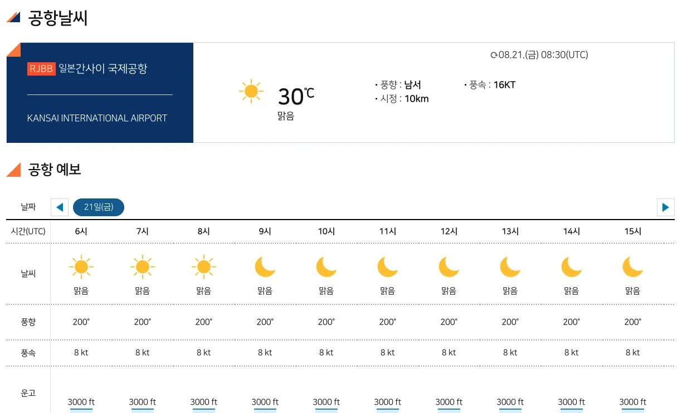
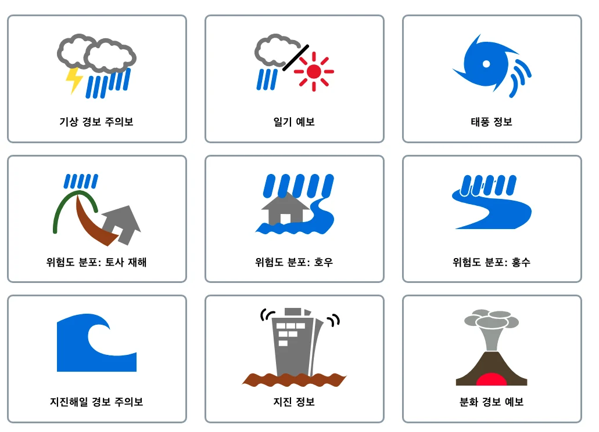

일본 여행 전날이나 출국 당일에는 도시 날씨뿐 아니라 도착 공항의 날씨도 함께 확인하는 것이 좋습니다. 특히 `일본 간사이공항 날씨`, `나리타공항 날씨`, `후쿠오카공항 날씨`처럼 공항 기준으로 보면 풍속, 시정, 구름고도, 공항 예보를 같이 확인할 수 있습니다.

> 이 글은 2026년 8월 21일 기준으로 항공기상청 공항날씨 페이지와 기존에 정리한 한국 출발 일본 직항 노선을 기준으로 작성했습니다. 실제 운항 여부와 지연·결항은 항공사와 공항 공식 운항정보에서 다시 확인해야 합니다.

이미지 출처: Wikimedia Commons, Ankou1192, CC BY-SA 4.0

## 한 줄 답변

일본 공항 날씨는 항공기상청 `공항날씨`에서 공항별로 바로 확인할 수 있습니다. 간사이공항은 `RJBB`, 나리타공항은 `RJAA`, 하네다공항은 `RJTT`, 후쿠오카공항은 `RJFF`처럼 ICAO 공항코드로 연결됩니다.

<a href="/posts/한국에서-일본-가는-직항-노선-정리/" style="display:grid;grid-template-columns:minmax(0,1fr) 150px;gap:12px;align-items:center;overflow:hidden;border:1px solid #3b82f6;border-radius:8px;background:#111827;padding:10px 12px;margin:16px 0;color:#f9fafb;text-decoration:none;">
  
    <strong style="display:block;color:#60a5fa;line-height:1.35;font-size:1rem;text-decoration:underline;">한국에서 일본 가는 직항 노선 총정리｜인천·부산·청주·김포 일본 공항 비교</strong>
  
  
</a>

## 간사이공항 날씨 바로가기

오사카, 교토, 고베 여행이라면 가장 먼저 볼 공항은 간사이공항입니다. 한국에서는 인천, 김포, 부산, 청주, 대구, 제주에서 간사이공항 직항 노선이 확인됩니다.

  <a href="https://amo.kma.go.kr/weather/airport.do?icaoCode=RJBB" target="_blank" rel="noopener noreferrer" style="display:grid;grid-template-columns:1fr auto;gap:12px;padding:14px 16px;color:#f9fafb;text-decoration:none;">
    
      <strong style="display:block;color:#f9fafb;">간사이 국제공항 날씨</strong>
      오사카·교토·고베 여행 전 공항날씨 확인
    
    ↗
  </a>

## 일본 주요 공항 날씨 빠른 정리

한국에서 일본으로 가는 직항 노선이 많은 공항부터 정리했습니다. 표의 `날씨 바로가기`를 누르면 항공기상청 공항날씨 페이지로 이동합니다.

| 일본 도착 공항 | 항공권 코드 | 항공기상청 코드 | 한국 출발공항 | 날씨 바로가기 |
|---|---|---|---|---|
| 오사카 간사이 | KIX | RJBB | 인천, 김포, 부산, 청주, 대구, 제주 | [간사이공항 날씨](https://amo.kma.go.kr/weather/airport.do?icaoCode=RJBB) |
| 도쿄 나리타 | NRT | RJAA | 인천, 부산, 청주, 대구, 제주 | [나리타공항 날씨](https://amo.kma.go.kr/weather/airport.do?icaoCode=RJAA) |
| 후쿠오카 | FUK | RJFF | 인천, 부산, 청주, 대구, 제주 | [후쿠오카공항 날씨](https://amo.kma.go.kr/weather/airport.do?icaoCode=RJFF) |
| 나고야 주부 | NGO | RJGG | 인천, 김포, 부산, 청주 | [나고야공항 날씨](https://amo.kma.go.kr/weather/airport.do?icaoCode=RJGG) |
| 삿포로 신치토세 | CTS | RJCC | 인천, 부산, 청주 | [신치토세공항 날씨](https://amo.kma.go.kr/weather/airport.do?icaoCode=RJCC) |
| 오키나와 나하 | OKA | ROAH | 인천, 부산, 청주 | [나하공항 날씨](https://amo.kma.go.kr/weather/airport.do?icaoCode=ROAH) |
| 도쿄 하네다 | HND | RJTT | 인천, 김포 | [하네다공항 날씨](https://amo.kma.go.kr/weather/airport.do?icaoCode=RJTT) |
| 기타큐슈 | KKJ | RJFR | 인천, 청주 | [기타큐슈공항 날씨](https://amo.kma.go.kr/weather/airport.do?icaoCode=RJFR) |
| 히로시마 | HIJ | RJOA | 인천, 청주 | [히로시마공항 날씨](https://amo.kma.go.kr/weather/airport.do?icaoCode=RJOA) |
| 다카마쓰 | TAK | RJOT | 인천, 부산 | [다카마쓰공항 날씨](https://amo.kma.go.kr/weather/airport.do?icaoCode=RJOT) |
| 마쓰야마 | MYJ | RJOM | 인천, 부산 | [마쓰야마공항 날씨](https://amo.kma.go.kr/weather/airport.do?icaoCode=RJOM) |
| 구마모토 | KMJ | RJFT | 인천, 부산 | [구마모토공항 날씨](https://amo.kma.go.kr/weather/airport.do?icaoCode=RJFT) |
| 가고시마 | KOJ | RJFK | 인천, 부산 | [가고시마공항 날씨](https://amo.kma.go.kr/weather/airport.do?icaoCode=RJFK) |
| 시즈오카 | FSZ | RJNS | 인천, 부산 | [시즈오카공항 날씨](https://amo.kma.go.kr/weather/airport.do?icaoCode=RJNS) |

## 지방 일본 공항 날씨 바로가기

소도시 노선은 운항 요일과 시즌 변동이 생길 수 있습니다. 항공권을 예약했다면 출발 전날과 당일에 공항날씨, 항공사 운항정보, 공항 공식 운항정보를 함께 확인하는 편이 좋습니다.

| 일본 도착 공항 | 항공권 코드 | 항공기상청 코드 | 한국 출발공항 | 날씨 바로가기 |
|---|---|---|---|---|
| 요나고 | YGJ | RJOH | 인천 | [요나고공항 날씨](https://amo.kma.go.kr/weather/airport.do?icaoCode=RJOH) |
| 사가 | HSG | RJFS | 인천 | [사가공항 날씨](https://amo.kma.go.kr/weather/airport.do?icaoCode=RJFS) |
| 도쿠시마 | TKS | RJOS | 인천 | [도쿠시마공항 날씨](https://amo.kma.go.kr/weather/airport.do?icaoCode=RJOS) |
| 고베 | UKB | RJBE | 인천 | [고베공항 날씨](https://amo.kma.go.kr/weather/airport.do?icaoCode=RJBE) |
| 미야자키 | KMI | RJFM | 인천 | [미야자키공항 날씨](https://amo.kma.go.kr/weather/airport.do?icaoCode=RJFM) |
| 오이타 | OIT | RJFO | 인천 | [오이타공항 날씨](https://amo.kma.go.kr/weather/airport.do?icaoCode=RJFO) |
| 나가사키 | NGS | RJFU | 인천 | [나가사키공항 날씨](https://amo.kma.go.kr/weather/airport.do?icaoCode=RJFU) |
| 오카야마 | OKJ | RJOB | 인천 | [오카야마공항 날씨](https://amo.kma.go.kr/weather/airport.do?icaoCode=RJOB) |
| 고마쓰 | KMQ | RJNK | 인천 | [고마쓰공항 날씨](https://amo.kma.go.kr/weather/airport.do?icaoCode=RJNK) |
| 니가타 | KIJ | RJSN | 인천 | [니가타공항 날씨](https://amo.kma.go.kr/weather/airport.do?icaoCode=RJSN) |
| 센다이 | SDJ | RJSS | 인천 | [센다이공항 날씨](https://amo.kma.go.kr/weather/airport.do?icaoCode=RJSS) |
| 이시가키 | ISG | ROIG | 인천 | [이시가키공항 날씨](https://amo.kma.go.kr/weather/airport.do?icaoCode=ROIG) |
| 아오모리 | AOJ | RJSA | 인천 | [아오모리공항 날씨](https://amo.kma.go.kr/weather/airport.do?icaoCode=RJSA) |
| 이바라키 | IBR | RJAH | 청주 | [이바라키공항 날씨](https://amo.kma.go.kr/weather/airport.do?icaoCode=RJAH) |
| 모리오카 하나마키 | HNA | RJSI | 청주 | [하나마키공항 날씨](https://amo.kma.go.kr/weather/airport.do?icaoCode=RJSI) |
| 오비히로 | OBO | RJCB | 청주 | [오비히로공항 날씨](https://amo.kma.go.kr/weather/airport.do?icaoCode=RJCB) |
| 미야코지마 시모지시마 | SHI | RORS | 인천, 부산 | [시모지시마공항 날씨](https://amo.kma.go.kr/weather/airport.do?icaoCode=RORS) |

## 항공기상청 공항날씨에서 볼 것

항공기상청 공항날씨는 일반 여행 날씨 앱과 보는 포인트가 조금 다릅니다. 여행자는 전문 용어를 전부 해석하려고 하기보다, 항공편 지연과 연결될 수 있는 항목을 중심으로 보면 됩니다.

| 항목 | 여행자가 보면 좋은 이유 |
|---|---|
| 현재 날씨 | 공항 주변 비, 안개, 눈, 구름 상태 확인 |
| 풍향·풍속 | 강풍이면 이착륙 지연 가능성 확인 |
| 시정 | 안개나 악천후로 시야가 나쁜지 확인 |
| 운고 | 낮은 구름이 공항 운항에 영향을 줄 수 있는지 확인 |
| 공항 예보 | 출발·도착 시간대의 공항 기상 흐름 확인 |
| 도시별 예보 | 공항 도착 후 시내 이동과 여행 일정 참고 |

특히 태풍, 폭설, 짙은 안개, 강풍이 예상되는 날에는 공항날씨만 보고 결론 내리지 말고 항공사 앱의 운항 상태를 같이 확인해야 합니다. 공항날씨가 나빠 보여도 실제 운항 여부는 항공사와 공항 상황에 따라 달라질 수 있습니다.

태풍이 일본 쪽으로 접근하는 시기라면 일본 기상청의 여행자용 재난 정보와 태풍센터도 함께 확인하는 것이 좋습니다. 공항날씨는 공항 주변의 현재 기상과 공항 예보를 보는 데 유용하고, 일본 기상청 재난 정보는 태풍, 호우, 폭설, 지진, 쓰나미 같은 여행 중 위험 정보를 넓게 확인하는 용도에 가깝습니다.

  <a href="https://www.data.jma.go.jp/multi/index.html?lang=kr" target="_blank" rel="noopener noreferrer" style="display:grid;grid-template-columns:1fr auto;gap:12px;padding:14px 16px;border-bottom:1px solid #374151;color:#f9fafb;text-decoration:none;">
    
      <strong style="display:block;color:#f9fafb;">일본 기상청 여행자용 재난 정보</strong>
      태풍, 호우, 폭설, 지진, 쓰나미 등 여행 중 위험 정보 확인
    
    ↗
  </a>
  <a href="https://www.jma.go.jp/jma/jma-eng/jma-center/rsmc-hp-pub-eg/RSMC_HP.htm" target="_blank" rel="noopener noreferrer" style="display:grid;grid-template-columns:1fr auto;gap:12px;padding:14px 16px;color:#f9fafb;text-decoration:none;">
    
      <strong style="display:block;color:#f9fafb;">RSMC Tokyo 태풍센터</strong>
      일본 쪽으로 접근하는 태풍 경로와 강도 예보 참고
    
    ↗
  </a>

## 공항 날씨와 도시 날씨는 다를 수 있다

공항은 시내 중심부와 떨어져 있는 경우가 많습니다. 간사이공항은 바다 위 인공섬에 있고, 나리타공항은 도쿄 도심과 거리가 있습니다. 후쿠오카공항처럼 시내와 가까운 공항도 있지만, 공항 기준 날씨와 숙소 주변 날씨가 완전히 같다고 보기는 어렵습니다.

그래서 여행 전에는 아래처럼 나눠 확인하는 것이 좋습니다.

| 확인 대상 | 어디에 쓰나 |
|---|---|
| 공항날씨 | 항공편 지연·결항 가능성, 도착 직후 이동 판단 |
| 도시 날씨 | 옷차림, 우산, 관광 일정 조정 |
| 태풍·특보 | 항공편, 철도, 고속버스 영향 확인 |
| 공항 공식 운항정보 | 실제 출발·도착 지연 여부 확인 |

## FAQ

### 일본 간사이공항 날씨는 어디서 바로 보나요?

항공기상청 공항날씨에서 `간사이 국제공항`, 공항코드 `RJBB`로 확인할 수 있습니다. 오사카·교토·고베 여행 전에는 간사이공항 날씨와 항공사 운항정보를 함께 보는 것이 좋습니다.

### 항공기상청의 공항코드와 항공권 공항코드는 왜 다른가요?

항공권이나 예약 사이트에서 자주 보는 `KIX`, `NRT`, `FUK` 같은 코드는 IATA 코드입니다. 항공기상청 공항날씨 URL에 쓰이는 `RJBB`, `RJAA`, `RJFF` 같은 코드는 ICAO 코드입니다. 같은 공항을 가리키지만 쓰는 분야가 다릅니다.

### 공항날씨가 나쁘면 무조건 결항인가요?

아닙니다. 공항날씨는 참고 정보이고, 실제 지연·결항은 항공사 판단, 항공기 연결, 공항 운영 상황, 주변 공역 상황에 따라 달라질 수 있습니다. 출발 당일에는 항공사 앱과 공항 공식 운항정보를 같이 확인해야 합니다.

### 일본 여행 날씨는 항공기상청만 보면 되나요?

항공편 관점에서는 항공기상청 공항날씨가 유용하지만, 여행 일정과 옷차림은 일본 기상청이나 일반 날씨 앱도 함께 보는 것이 좋습니다. 태풍, 호우, 폭설, 지진 같은 재난 정보는 일본 기상청 여행자용 재난 정보와 태풍센터를 같이 확인하면 됩니다.

## 참고 자료

  <a href="https://amo.kma.go.kr/" target="_blank" rel="noopener noreferrer" style="display:grid;grid-template-columns:1fr auto;gap:12px;padding:14px 16px;border-bottom:1px solid #374151;color:#f9fafb;text-decoration:none;">
    
      <strong style="display:block;color:#f9fafb;">항공기상청 공항날씨</strong>
      한국어로 공항별 현재 날씨와 공항 예보 확인
    
    ↗
  </a>
  <a href="https://www.data.jma.go.jp/multi/index.html?lang=kr" target="_blank" rel="noopener noreferrer" style="display:grid;grid-template-columns:1fr auto;gap:12px;padding:14px 16px;border-bottom:1px solid #374151;color:#f9fafb;text-decoration:none;">
    
      <strong style="display:block;color:#f9fafb;">일본 기상청 여행자용 재난 정보</strong>
      태풍, 호우, 폭설, 지진, 쓰나미 등 여행 중 위험 정보 확인
    
    ↗
  </a>
  <a href="https://www.jma.go.jp/jma/jma-eng/jma-center/rsmc-hp-pub-eg/RSMC_HP.htm" target="_blank" rel="noopener noreferrer" style="display:grid;grid-template-columns:1fr auto;gap:12px;padding:14px 16px;border-bottom:1px solid #374151;color:#f9fafb;text-decoration:none;">
    
      <strong style="display:block;color:#f9fafb;">RSMC Tokyo 태풍센터</strong>
      서태평양 태풍 경로와 강도 예보 참고
    
    ↗
  </a>
  <a href="https://aviationweather.gov/data/api/" target="_blank" rel="noopener noreferrer" style="display:grid;grid-template-columns:1fr auto;gap:12px;padding:14px 16px;color:#f9fafb;text-decoration:none;">
    
      <strong style="display:block;color:#f9fafb;">Aviation Weather Center Data API</strong>
      METAR·TAF 같은 세계 공항 항공기상 데이터 참고
    
    ↗
  </a>

이미지 출처: [Wikimedia Commons - Aerial view of Kansai International Airport](https://commons.wikimedia.org/wiki/File:%E9%96%A2%E8%A5%BF%E5%9B%BD%E9%9A%9B%E7%A9%BA%E6%B8%AF%E5%85%A8%E4%BD%93%E5%86%99%E7%9C%9F20220811_(cropped).jpg), Ankou1192, CC BY-SA 4.0.

## 관련 글

  <strong style="display:block;color:#f9fafb;margin-bottom:12px;">관련해서 바로 보기</strong>
  

    <a href="/posts/한국에서-일본-가는-직항-노선-정리/" style="display:block;color:#f9fafb;text-decoration:none;">
      
      <strong style="display:block;color:#f9fafb;margin-top:8px;line-height:1.35;">한국에서 일본 가는 직항 노선 총정리</strong>
    </a>
    <a href="/posts/일본-여행-도움-되는-사이트-모음/" style="display:block;color:#f9fafb;text-decoration:none;">
      
      <strong style="display:block;color:#f9fafb;margin-top:8px;line-height:1.35;">일본 여행 사이트 모음｜Visit Japan Web·교통·날씨·공항 준비</strong>
    </a>
  

