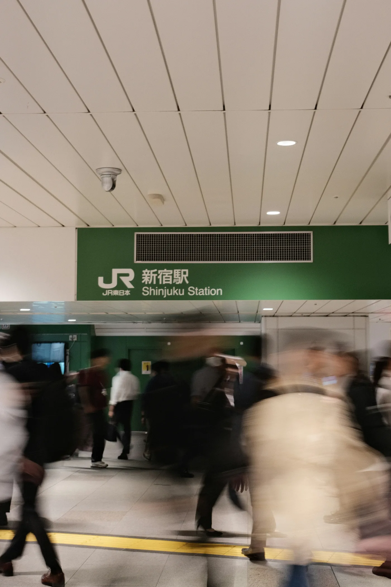
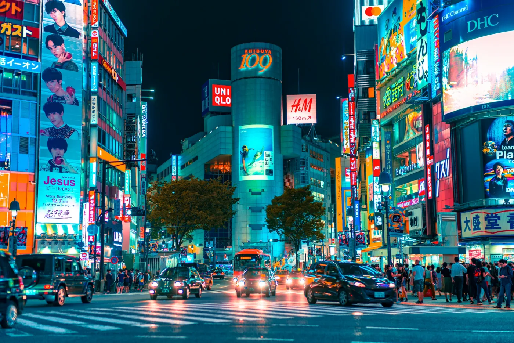
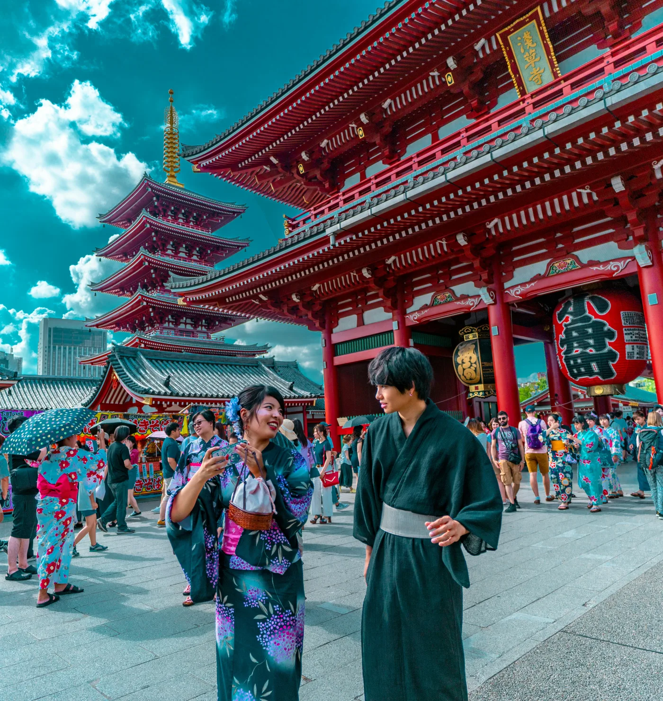

일본 여행에서 실제로 헷갈리는 건 예절을 몰라서라기보다 한국에서 익숙한 방식이 일본 현장과 다를 때입니다. 자동차는 좌측통행이지만 보행자가 항상 왼쪽으로 걷는 것은 아닙니다. 지하철에서는 식사를 하지 않는 쪽이 맞고, 신칸센에서는 도시락을 먹어도 자연스럽습니다.

이 글은 “하면 안 되는 행동”을 길게 외우기보다, 여행 중 바로 판단할 수 있는 기준을 중심으로 정리했습니다.

> 이 글은 일본정부관광국, 일본 경찰청, 도쿄메트로, JR도카이, 도쿄경찰청의 공식 안내를 참고해 정리했습니다.

## 한 줄 답변

일본 여행 주의사항은 무조건 금지보다 상황 구분이 중요합니다. 특히 사유지 촬영, 길거리 흡연, 신칸센 대형 수하물, 온천 문신, 지역 버스 요금처럼 현장에서 제지받거나 추가 비용이 생기는 항목부터 확인해야 합니다.

## 일본 여행 주의사항 빠른 답변

| 질문 | 결론 | 예외·확인 기준 |
|---|---|---|
| 일본에서는 보행자도 항상 왼쪽으로 걸어야 하나요? | 아닙니다. 자동차는 좌측통행이지만 보행자는 항상 왼쪽으로 걷지 않습니다. | 역, 지하상가, 계단은 바닥 화살표를 따릅니다. 보도가 없는 도로에서는 도로 오른쪽 가장자리로 걷는 것이 원칙입니다. |
| 일본 에스컬레이터는 도쿄 왼쪽, 오사카 오른쪽인가요? | 지역 습관은 절대 규칙이 아닙니다. 현장 안내가 기준입니다. | 캐리어가 크면 에스컬레이터보다 엘리베이터를 이용합니다. 에스컬레이터에서는 걷거나 뛰지 않습니다. |
| 일본 전철 안에서 음식을 먹어도 되나요? | 지하철과 출퇴근 전철에서는 먹지 않습니다. | 신칸센과 장거리 열차에서는 도시락을 먹어도 자연스럽습니다. 냄새가 강한 음식은 피합니다. |
| 일본 버스는 탈 때 교통카드를 찍나요? | 버스 안 표시를 먼저 봅니다. | 균일요금은 1회 태그, 구간요금은 승차·하차 2회 태그하거나 정리권으로 정산하는 경우가 있습니다. |
| 일본 식당에 빈자리가 있으면 바로 앉아도 되나요? | 바로 앉지 않습니다. 입구에서 직원 안내를 기다립니다. | `食券` 자판기가 있으면 먼저 결제합니다. `受付`, `順番待ち`가 있으면 대기명단이나 번호표를 확인합니다. |
| 일본에서 길거리 음식을 먹으면 실례인가요? | 걸어 다니며 먹는 것은 피합니다. | 축제, 시장, 지정 취식 공간, 구입한 가게 앞 안내가 있는 곳에서는 먹어도 됩니다. |
| 일본 온천에 문신이 있으면 이용할 수 없나요? | 문신 금지 시설은 입욕할 수 없습니다. | 문신 가리개 허용 시설, 대절탕, 문신 허용 온천은 이용 가능합니다. 방문 전 `タトゥー` 안내를 확인해야 합니다. |
| 일본 관광지에서 사진 촬영해도 되나요? | 촬영금지 표시가 있으면 찍지 않습니다. 사유지에는 들어가지 않습니다. | 야외라도 본당, 실내, 상점, 주택가, 농경지는 규정이 다릅니다. 사람 얼굴이 크게 나오는 촬영은 피합니다. |
| 일본에서 길거리 흡연해도 되나요? | 지정 흡연구역 밖에서는 피우지 않습니다. | 일부 지역은 노상흡연을 제한하고 과태료를 부과합니다. 전자담배도 흡연구역 기준을 따릅니다. |
| 신칸센에 큰 캐리어를 들고 탈 수 있나요? | 큰 캐리어는 예매 전 수하물 규정을 확인해야 합니다. | 도카이도·산요·큐슈 신칸센은 일정 크기 초과 수하물에 별도 공간 예약이 필요합니다. |

## 특히 조심할 부분

아래 항목은 단순히 “매너가 좋다, 나쁘다”의 문제가 아닙니다. 현장에서 제지받거나 이용이 제한되는 부분입니다. 처음 일본을 가는 여행자라면 이 부분을 먼저 확인해야 합니다.

| 주의할 상황 | 문제되는 이유 | 현장에서 보는 기준 |
|---|---|---|
| 길거리 흡연 | 일부 지역은 지정 구역 밖 흡연을 제한하고 과태료를 부과합니다. | 흡연소, 흡연실, 노상흡연금지 표시 |
| 사유지·골목 촬영 | 교토, 주택가, 농경지, 상점 앞에서는 관광객 촬영으로 민원이 자주 생깁니다. | `立入禁止`, 촬영금지, 사유지 안내 |
| 신칸센 큰 캐리어 | 노선과 크기에 따라 대형 수하물 공간 예약이 필요합니다. | 세 변 합계, oversized baggage 안내 |
| 온천 문신 | 시설에 따라 입욕이 제한됩니다. | `タトゥー`, 가리개 허용, 대절탕 |
| 지역 버스 현금 결제 | 균일요금이 아닌 노선은 정리권을 놓치면 요금 확인이 어렵습니다. | `整理券`, 번호별 운임표, 하차 정산기 |
| 자전거 이용 | 관광지에서 자전거를 보행자처럼 타면 사고와 단속 위험이 있습니다. | 차도 통행, 신호, 주차 가능 구역 |
| 실내 사진·영상 | 미술관, 상점, 신사 본당은 야외와 촬영 규정이 다릅니다. | `撮影禁止`, 플래시 금지, 영상 금지 |

## 한국 여행자가 특히 헷갈리는 상황

한국과 일본의 방식이 미묘하게 다른 부분은 아래처럼 구분하면 됩니다.

| 한국에서 익숙한 생각 | 일본에서 다시 봐야 할 점 |
|---|---|
| 길 찾기는 잠깐 서서 보면 된다 | 대형 역에서는 개찰구 앞에 서지 말고 벽, 기둥, 출구 안내판 옆으로 빠져서 확인합니다. |
| 버스는 대체로 탈 때 찍는다 | 지역 버스는 탈 때와 내릴 때 모두 찍거나, 정리권을 뽑고 하차 때 정산하는 경우가 있습니다. |
| 빈자리가 있으면 앉아도 된다 | 식당은 식권기, 대기명단, 직원 안내가 먼저인 경우가 많습니다. |
| 관광지는 사진을 찍는 곳이다 | 관광지 안에도 실내, 본당, 사유지, 주민 생활공간처럼 촬영하면 안 되는 구역이 섞여 있습니다. |
| 온천은 수영장처럼 이용하면 된다 | 몸을 씻고 들어가며, 수건·머리카락·휴대전화·문신 규정을 따로 지켜야 합니다. |
| 편의점 쓰레기는 아무 데나 버릴 수 있다 | 일본 거리는 공용 쓰레기통이 적고, 자판기 옆 수거함도 캔·페트병 전용인 경우가 많습니다. |

## 공식 안내로 확인할 수 있는 주요 기준

| 주제 | 공식 안내 | 글에서 확인할 내용 |
|---|---|---|
| 문화와 매너 | 일본정부관광국 문화·예절 안내 | 신사·사찰, 거리, 사진 촬영 예절 |
| 책임 있는 여행 | 일본정부관광국 에티켓 안내 | 지역 주민과 장소를 배려하는 여행 |
| 보행·교통안전 | 일본 경찰청 교통안전 규칙 | 좌측통행, 보행 방향, 횡단 시 주의 |
| 지하철 예절 | 도쿄메트로 이용 주의사항 | 통화 자제, 승하차, 큰 짐 관리 |
| 신칸센 수하물 | JR도카이 대형 수하물 규정 | 큰 캐리어 사전 예약 필요 여부 |
| 자전거 | 도쿄경찰청 자전거 안전수칙 | 자전거 교통법규와 안전수칙 |

## 현장에서 먼저 볼 표시

일본어를 잘 몰라도 아래 표현은 여행 중 자주 보입니다. 이런 표시가 있으면 주변 분위기보다 안내문을 우선해야 합니다.

| 표시 | 뜻 | 어디서 보나 |
|---|---|---|
| 撮影禁止 | 촬영 금지 | 사찰, 미술관, 상점, 공연장 |
| 立入禁止 | 출입 금지 | 사유지, 철도 주변, 정원, 공사 구역 |
| 食券 | 식권 | 라멘집, 덮밥집, 소바집 |
| 受付 | 접수 | 식당 대기, 온천, 렌터카, 체험시설 |
| 順番待ち | 순서 대기 | 식당, 매장, 관광시설 |
| 整理券 | 정리권 | 지역 버스, 대기열, 번호표 발권 |
| 飲食スペース | 취식 공간 | 시장, 푸드코트, 관광지 매장 |
| タトゥー | 문신·타투 | 온천, 대욕장, 수영장 |

## 1. 이동과 보행 예절

### 자동차는 좌측통행, 보행자는 현장 표시 우선

일본에서는 자동차가 도로 왼쪽으로 달립니다. 한국에서 익숙한 방향과 반대쪽에서 차량이 접근할 수 있으므로 횡단보도를 건널 때는 반드시 좌우를 모두 확인해야 합니다.

다만 자동차가 좌측통행한다고 해서 보행자까지 언제나 왼쪽으로 걸어야 하는 것은 아닙니다. 역과 지하상가, 계단에서는 바닥 화살표와 안내표시를 따르면 됩니다. 시설에 따라 이동 방향이 다를 수 있기 때문입니다.

보도가 없는 도로에서는 일본 교통규칙상 보행자가 도로 오른쪽 가장자리를 이용하는 것이 원칙입니다. 차가 다니는 방향을 외우기보다 마주 오는 차량을 확인하면서 이동한다고 생각하면 이해하기 쉽습니다.

### 역에서는 통행로 가운데 멈추지 않기

일본의 대형 역은 여러 철도회사가 연결되어 있고 출구도 많아 지도를 확인할 일이 자주 생깁니다. 이때 개찰구나 계단, 에스컬레이터 출구 앞에 멈추면 뒤에 오는 사람들의 이동을 막습니다.

경로를 확인할 때는 통로 중앙을 벗어나 벽이나 기둥 쪽으로 이동합니다. 특히 도쿄역, 신주쿠역, 시부야역처럼 노선과 출구가 많은 역에서는 출구 번호를 먼저 확인해야 빠릅니다. “동쪽 출구”처럼 큰 방향만 보고 움직이면 같은 역 안에서도 꽤 멀리 돌아갑니다.

승강장에서는 바닥에 표시된 승차 위치에 줄을 서고, 내리는 승객이 모두 내린 다음 탑승합니다.

열차를 놓칠 것 같더라도 승강장에서 뛰거나 닫히는 문에 몸과 짐을 넣는 행동은 피해야 합니다.

### 에스컬레이터는 지역보다 현장 안내 따르기

도쿄에서는 왼쪽, 오사카에서는 오른쪽에 선다는 이야기가 알려져 있지만 이를 절대적인 여행 규칙으로 외울 필요는 없습니다. 지역뿐 아니라 시설에 따라서도 이용 방식이 달라질 수 있기 때문입니다.

기준은 현장 안내입니다. 에스컬레이터에서는 걷거나 뛰지 않습니다. 큰 캐리어를 가지고 있다면 에스컬레이터보다 엘리베이터를 이용합니다.

### 열차 안에서는 통화와 큰 대화 자제하기

일본의 지하철과 일반 열차에서는 휴대전화를 무음으로 설정하고 통화를 자제하는 분위기가 일반적입니다. 도쿄메트로도 열차 안에서 주변 승객을 배려하는 이용 방식을 안내하고 있습니다.

영상이나 음악은 이어폰을 사용하고, 일행과 대화할 때도 목소리를 낮춥니다. 혼잡한 열차에서는 등에 멘 배낭이 다른 승객에게 닿기 쉬우므로 앞으로 메거나 내려서 듭니다. 캐리어도 출입문과 통로를 막지 않게 둡니다.

일반 지하철이나 출퇴근 전철에서는 식사를 하지 않습니다. 신칸센과 일부 장거리 열차에서는 도시락을 먹어도 자연스럽습니다. 열차 종류를 구분하면 됩니다.

### 신칸센 대형 수하물은 “자리 예약” 문제일 수 있다

신칸센을 이용할 때는 대형 수하물 규정을 확인해야 합니다. JR도카이는 도카이도·산요·큐슈 신칸센에서 일정 크기를 넘는 수하물은 전용 좌석 또는 지정된 보관 공간을 이용하도록 안내합니다.

큰 캐리어를 가지고 도쿄, 교토, 오사카, 후쿠오카를 이동한다면 예매 전에 수하물 크기와 예약 가능 좌석을 확인해야 합니다. 여행 중 가장 당황하기 쉬운 지점은 “캐리어를 들고 탈 수 있느냐”보다 “내 캐리어를 둘 공간이 있는 좌석을 예약했느냐”입니다.

### 버스마다 승차 방법이 다를 수 있다

일본 버스는 지역과 노선에 따라 타고 내리는 문과 요금 지불 방식이 다릅니다.

어떤 버스는 뒷문으로 타서 앞문으로 내리고, 다른 버스는 앞문으로 탑승합니다. 교통카드 역시 탈 때만 태그하는 노선과 승차·하차 때 모두 태그하는 노선이 나뉩니다.

버스에 탑승하기 전에는 세 가지만 보면 됩니다. 앞문과 뒷문 중 어디가 열리는지, 승차구에 `整理券` 발급기가 있는지, IC카드 리더기가 탈 때와 내릴 때 모두 있는지입니다. 현금으로 이용하는 지역버스에서는 승차할 때 정리권을 뽑고 하차하면서 번호별 요금을 내는 경우도 있습니다.

정리권이 있는 버스는 하차할 때 운전석 앞 운임표에서 정리권 번호와 같은 칸의 요금을 확인하는 방식입니다. 한국 시내버스처럼 “일단 타면 알아서 같은 요금”이라고 생각하면 요금 정산에서 당황합니다.

### 자전거는 보행자처럼 생각하면 안 된다

일본 여행 중 공유 자전거나 렌터사이클을 이용할 수도 있습니다. 이때 자전거는 보행자와 같은 방식으로 움직이는 것이 아니라 교통규칙을 따라야 합니다.

도쿄경찰청은 자전거 안전수칙에서 차도 통행, 신호 준수, 보행자 배려 등 기본 규칙을 안내합니다. 낯선 지역에서 자전거를 이용한다면 보행자 많은 상점가나 좁은 골목에서는 속도를 줄이고, 주차 가능 구역도 따로 확인합니다.

## 2. 식당과 거리에서의 예절

### 줄 서기와 식당 입장 방식 확인하기

일본에서는 식당, 계산대, 버스정류장 등에서 지정된 대기선을 따라 줄을 서는 경우가 많습니다. 사람이 많지 않더라도 바닥의 줄 표시나 대기 명단, 번호표 발권기부터 확인해야 합니다.

식당 안에 빈자리가 보여도 바로 들어가 앉지 않습니다. 입구에서 직원 안내를 기다립니다. 입구에 `食券`이라고 적힌 자판기가 있으면 먼저 결제하고 표를 건네는 방식이고, `受付`나 `順番待ち`가 보이면 대기명단이나 번호표를 먼저 확인하는 방식입니다.

일반적인 식당이나 택시에서는 별도의 팁을 주지 않습니다. 테이블에 현금을 두고 나오면 팁이 아니라 두고 간 돈으로 오해받습니다.

### 길거리 음식은 금지보다 장소와 쓰레기가 중요하다

일본에서는 걸으면서 음식을 먹는 행위가 모두 금지된 것은 아닙니다. 축제나 시장처럼 길거리 음식을 즐기는 장소도 많습니다.

다만 관광객이 몰리는 상점가나 시장에서는 구입한 가게 앞 또는 지정된 취식 공간에서 먹도록 안내하는 경우가 있습니다. `食べ歩き禁止`는 걸어 다니며 먹지 말라는 뜻이고, `飲食スペース`가 보이면 그 공간에서 먹으면 됩니다. 지역과 시설의 안내문을 확인하고, 발생한 쓰레기는 지정된 수거함에 버리면 됩니다.

일본 거리에는 공용 쓰레기통이 많지 않으므로 작은 봉투를 준비합니다. 자판기 옆 수거함은 일반 쓰레기통이 아니라 캔이나 페트병 전용인 경우가 많으니 분리표시를 확인해야 합니다. 편의점에서 산 음식 포장도 매장 밖에 버릴 곳이 없을 때가 있습니다. 숙소까지 가져갈 상황까지 계산해야 합니다.

## 3. 관광지와 숙소에서의 예절

### 사진은 촬영금지와 사유지 여부부터 확인하기

신사와 사찰, 상점, 미술관, 식당 등에서는 장소별로 촬영 규정이 다릅니다. 야외에서는 촬영할 수 있어도 본당이나 실내에서는 촬영을 금지하는 경우가 있으므로 `撮影禁止` 표시를 먼저 확인해야 합니다.

사람의 얼굴이 식별될 정도로 가까이서 촬영하거나 특정 인물을 계속 따라가며 촬영하지 않습니다. 특히 교토의 마이코와 게이샤, 공연자, 상점 직원 등을 촬영할 때는 상대방과 장소의 허용 여부를 확인해야 합니다.

철도 승강장에서는 사진을 찍기 위해 안전선을 넘거나 플래시, 삼각대, 셀카봉으로 다른 승객의 통행을 방해해서는 안 됩니다. 유명 촬영지라도 `立入禁止` 표시가 있거나 사유지·농경지로 보이는 곳에는 들어가지 않아야 합니다.

특히 “사람이 사는 거리”와 “관광지처럼 보이는 거리”가 붙어 있는 지역에서는 더 엄격하게 봐야 합니다. 예쁜 골목, 전통가옥 앞, 논밭이 보이는 촬영지라도 실제로는 주민 생활공간이거나 사유지인 경우가 있습니다.

### 신사와 사찰에서는 조용히 관람하기

신사와 사찰의 세부 참배법을 모두 외울 필요는 없습니다. 경내에서 목소리를 낮추고 출입금지 구역에 들어가지 않으며, 문화재를 만지지 않는 것이 기본입니다.

종교의식이나 참배 중인 사람을 가까이서 촬영하지 않습니다. 본당과 실내에서는 촬영 가능 표시가 있을 때만 찍습니다. 세부 예법이 헷갈리면 현장 안내를 따르면 됩니다.

일본정부관광국은 여행자가 지역 주민과 장소를 배려하고, 확실하지 않은 상황에서는 현지 안내를 확인하는 태도를 권합니다. 관광지에서는 “다른 사람이 같은 공간을 함께 이용한다”는 점을 기준으로 행동하면 됩니다.

### 온천에서는 입욕 전에 몸 씻기

일본 온천과 대중목욕탕에서는 탕에 들어가기 전에 세면 공간에서 몸을 씻습니다. 작은 수건은 욕탕 물속에 넣지 않습니다. 긴 머리는 물에 닿지 않도록 묶습니다.

탈의실과 욕실에서는 휴대전화와 카메라를 사용하지 않습니다. 문신 이용 규정은 시설마다 다르므로 방문 전에 공식 홈페이지에서 `タトゥー`, `入浴`, `貸切風呂` 같은 안내를 확인해야 합니다. 문신 가리개를 허용하거나 대절탕을 이용할 수 있는 곳도 있습니다.

### 료칸에서는 신발과 슬리퍼 구분하기

료칸이나 일부 숙박시설에서는 현관에서 신발을 벗습니다. 객실이나 복도에서 사용하는 일반 슬리퍼와 화장실 전용 슬리퍼가 따로 마련된 경우도 있으므로 구분해서 사용해야 합니다.

유카타를 입고 이동할 수 있는 범위나 대욕장 이용시간도 숙소마다 다릅니다. 객실에 제공된 안내문을 먼저 확인하면 됩니다.

### 흡연은 지정된 장소에서만 하기

일본의 여러 도시에서는 길거리 흡연을 제한합니다. 일반 담배뿐 아니라 전자담배도 지정된 흡연구역이나 흡연실에서만 이용합니다.

식당과 숙소 역시 금연·흡연 구역이 구분되어 있으므로 예약하거나 입장하기 전에 표시를 확인해야 합니다.

## 결론: 외울 것보다 구분할 것

일본 여행 주의사항은 “일본에서는 무조건 이렇게 한다”로 외우면 오히려 틀리기 쉽습니다.

1. 자동차는 좌측통행이지만 보행 방향은 시설 표시가 우선입니다.
2. 에스컬레이터는 도시별 습관보다 현장 안내와 안전이 우선입니다.
3. 전철 음식은 지하철·출퇴근 전철과 신칸센을 구분해서 보면 됩니다.
4. 버스는 앞문·뒷문, 정리권, IC카드 태그 위치를 먼저 확인합니다.
5. 식당은 빈자리보다 식권기, 대기명단, 직원 안내를 먼저 봅니다.
6. 길거리 음식은 금지 여부보다 먹는 장소와 쓰레기 처리 방식이 중요합니다.
7. 사진은 촬영금지 표시, 사유지, 사람 얼굴 노출을 확인합니다.
8. 온천 문신 규정은 시설마다 다르므로 방문 전 공식 안내를 확인합니다.

## FAQ

### 일본에서는 보행자도 항상 왼쪽으로 걸어야 하나요?

아닙니다. 자동차는 좌측통행이지만 보행 방향은 시설별 안내가 우선입니다. 역, 지하상가, 계단, 통로에서는 바닥 화살표와 안내표시를 따르면 됩니다.

### 일본 전철 안에서 음식을 먹어도 되나요?

일반 지하철이나 출퇴근 전철에서는 식사하지 않습니다. 신칸센이나 일부 장거리 열차에서는 도시락을 먹어도 자연스럽습니다. 다만 냄새가 강한 음식이나 주변 승객에게 불편을 주는 행동은 피해야 합니다.

### 일본 식당에서는 팁을 줘야 하나요?

일반적인 식당과 택시에서는 팁을 주지 않습니다. 테이블에 현금을 두고 나오면 두고 간 돈으로 오해받습니다.

### 일본 온천에서 문신이 있으면 이용할 수 없나요?

시설마다 다릅니다. 문신이 있으면 입장을 제한하는 곳도 있고, 가리개를 허용하거나 대절탕을 이용할 수 있는 곳도 있습니다. 방문 전 공식 홈페이지에서 문신 이용 규정을 확인해야 합니다.

### 일본에서 사진 촬영할 때 가장 조심할 점은 무엇인가요?

촬영금지 표시와 사유지 여부를 먼저 확인해야 합니다. 사람의 얼굴이 크게 보이거나 특정 인물을 계속 따라가며 촬영하는 행동은 피해야 합니다.

## 참고 자료

- [일본정부관광국 문화·예절 안내](https://www.japan.travel/en/plan/custom-manners/)
- [일본정부관광국 일본 여행 에티켓 안내](https://www.japan.travel/en/responsible-travel-guide/)
- [일본 경찰청 교통안전 규칙 PDF](https://www.npa.go.jp/english/bureau/traffic/document/TrafficSafetyRules.pdf)
- [도쿄메트로 지하철 이용 주의사항·예절](https://www.tokyometro.jp/en/tips/considerations/index.html)
- [JR도카이 신칸센 대형 수하물 규정](https://global.jr-central.co.jp/en/info/oversized-baggage/index.html)
- [도쿄경찰청 자전거 이용 안전수칙 PDF](https://www.keishicho.metro.tokyo.lg.jp/multilingual/english/traffic_safety/traffic_rules/SAFE_BICYCLE_RIDING.files/public.pdf)
