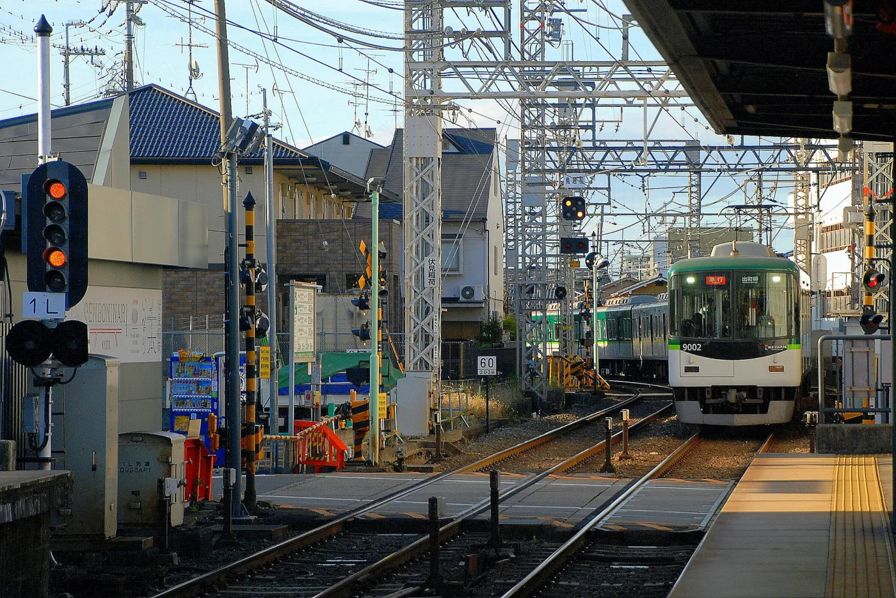

일본 지하철 노선도는 도시마다 운영 회사와 표기 방식이 조금씩 다릅니다. 그래도 여행자가 먼저 볼 것은 비슷합니다. `노선 색상`, `알파벳 기호`, `역 번호`, `환승역`, `운영 회사`만 구분하면 도쿄·오사카·후쿠오카 같은 대도시에서도 이동 경로를 훨씬 쉽게 찾을 수 있습니다.

이 글에서는 일본 주요 도시의 지하철 노선도 사이트를 한곳에 모으고, 일본어를 잘 몰라도 노선도를 읽는 기본 방법을 정리했습니다.

> 이 글은 2026년 8월 18일 기준으로 확인한 도시별 공식·참고 사이트를 바탕으로 작성했습니다. 노선 수, 노선명, 안내 페이지는 운영사 사정에 따라 바뀔 수 있으므로 여행 전 공식 사이트에서 다시 확인하세요.

## 한 줄 답변

일본 지하철 노선도는 역 이름보다 `노선 색상 + 알파벳 + 역 번호`를 먼저 보면 쉽습니다. 도쿄는 도쿄메트로·도에이, 오사카는 오사카 메트로, 후쿠오카는 공항선·하코자키선·나나쿠마선을 중심으로 보면 여행 동선을 잡기 좋습니다.

## 일본 지하철 노선도 모음 한눈에 정리

아래 표는 여행자가 자주 찾는 일본 도시별 지하철·도시철도 노선도 링크입니다. `노선 수`는 지하철 또는 해당 도시 교통망을 여행자가 파악하기 위한 기준으로 정리했으며, 노면전차·모노레일처럼 지하철이 아닌 도시 교통도 함께 포함했습니다.

| 도시 | 운영사·교통수단 | 노선 수 | 한국어 공식·참고 사이트 |
|---|---|---:|---|
| 도쿄 | 도쿄메트로·도에이 지하철 | 13개 | [도쿄메트로 노선도](https://www.tokyometro.jp/kr/subwaymap/index.html) |
| 오사카 | 오사카 메트로 | 9개 | [오사카 메트로 가이드](https://metronine.osaka/ko/fullpage-course/) |
| 나고야 | 나고야 시영 지하철·메이테쓰 등 | 6개 | [나고야 철도 노선도](https://www.meitetsu.co.jp/kor/train/route/map/) |
| 후쿠오카 | 후쿠오카 시영 지하철 | 3개 | [후쿠오카 지하철 노선도](https://subway.city.fukuoka.lg.jp/kor/route/) |
| 삿포로 | 삿포로 시영 지하철 | 3개 | [삿포로 지하철 노선도](https://www.city.sapporo.jp/st/korean/routemap.html) |
| 고베 | 고베 시영 지하철 | 2개 | [고베 지하철 노선도](https://kotsu.city.kobe.lg.jp/korean/kr-subway-map/) |
| 교토 | 교토 시영 지하철 | 2개 | [교토 교통 가이드](https://www.westjr.co.jp/global/kr/ticket/pass/kansai/kyoto_guide.html) |
| 요코하마 | 요코하마 시영 지하철 | 2개 | [요코하마 블루라인 참고](https://ko.wikipedia.org/wiki/%EC%9A%94%EC%BD%94%ED%95%98%EB%A7%88_%EC%8B%9C%EC%98%81_%EC%A7%80%ED%95%98%EC%B2%A0_%EB%B8%94%EB%A3%A8_%EB%9D%BC%EC%9D%B8) |
| 센다이 | 센다이 시영 지하철 | 2개 | [센다이 지하철 안내](https://www.jametro.or.jp/ko/japan/sendai.html) |
| 히로시마 | 히로시마 전철 | 노면전차 | [히로시마 2차 교통 안내](https://dive-hiroshima.com/kr/information/secondary-transport/) |
| 기타큐슈 | 기타큐슈 모노레일 | 1개 | [기타큐슈 모노레일](https://www.kitakyushu-monorail.co.jp/korean/) |

요코하마, 히로시마, 기타큐슈처럼 지하철만으로 설명하기 애매한 도시는 여행자가 실제로 쓰는 도시 교통 기준으로 넣었습니다. 특히 히로시마는 지하철보다 노면전차를 중심으로 동선을 보는 편이 자연스럽습니다.

## 일본 지하철 노선도가 복잡해 보이는 이유

일본의 도시 교통은 한 회사가 전체 노선을 운영하는 구조가 아닙니다. 같은 도시 안에서도 지하철, JR, 사철, 공항철도, 노면전차, 모노레일이 함께 연결됩니다.

예를 들어 도쿄는 도쿄메트로와 도에이 지하철이 따로 있고, 여기에 JR 야마노테선과 여러 사철 노선이 겹칩니다. 오사카도 오사카 메트로만 있는 것이 아니라 JR 서일본, 한큐, 한신, 난카이, 긴테쓰 같은 사철이 같이 움직입니다.

그래서 노선도에서 선이 이어져 보인다고 해서 항상 같은 회사 노선이거나 같은 티켓으로 이동할 수 있는 것은 아닙니다. 노선도는 `색상`만 보는 것이 아니라 `운영 회사`까지 함께 확인해야 합니다.

<a href="/posts/일본-여행-도움-되는-사이트-모음/" style="display:grid;grid-template-columns:minmax(0,1fr) 150px;gap:12px;align-items:center;overflow:hidden;border:1px solid #3b82f6;border-radius:8px;background:#111827;padding:10px 12px;margin:16px 0;color:#f9fafb;text-decoration:none;">
  
    <strong style="display:block;color:#60a5fa;line-height:1.35;font-size:1rem;text-decoration:underline;">일본 여행 사이트 모음｜Visit Japan Web·교통·날씨·공항 준비</strong>
  
  
</a>

## 일본 지하철 노선도 보는 법

노선도는 아래 순서로 보면 됩니다.

| 순서 | 확인할 것 | 보는 이유 |
|---:|---|---|
| 1 | 출발역과 목적지 역 | 이동할 두 지점을 먼저 정합니다. |
| 2 | 노선 색상 | 노선도를 빠르게 따라가기 쉽습니다. |
| 3 | 알파벳 기호 | 역명보다 노선을 구분하기 쉽습니다. |
| 4 | 역 번호 | 현재 위치와 목적지까지 남은 역 수를 가늠할 수 있습니다. |
| 5 | 환승역 | 다른 노선으로 갈아타는 위치를 확인합니다. |
| 6 | 운영 회사 | 지하철, JR, 사철이 바뀌는지 확인합니다. |
| 7 | 목적지 방향 | 플랫폼에서 종착역과 행선지를 확인합니다. |

핵심은 역 이름을 완벽하게 읽는 것이 아닙니다. 여행 중에는 역 이름, 노선 색상, 알파벳, 역 번호를 같이 대조하면 실수를 줄일 수 있습니다.

## 역 번호와 알파벳 읽는 법

일본 주요 지하철은 역마다 알파벳과 숫자를 조합한 역 번호를 사용합니다. 예를 들어 오사카 메트로 미도스지선의 우메다역은 `M16`처럼 표시됩니다. 여기서 `M`은 미도스지선, `16`은 해당 노선의 역 번호를 뜻합니다.

도쿄메트로도 노선별 알파벳과 역 번호를 사용합니다. 도쿄 긴자선은 `G`, 마루노우치선은 `M`처럼 표시되며, 역명 간판과 노선도에서 함께 볼 수 있습니다.

| 도시 | 표기 예시 | 의미 |
|---|---|---|
| 도쿄 | G-09 | 긴자선 9번 역 |
| 도쿄 | M-16 | 마루노우치선 16번 역 |
| 오사카 | M16 | 미도스지선 16번 역 |
| 오사카 | C11 | 주오선 11번 역 |
| 후쿠오카 | K06 | 공항선 계열 역 번호 |

단, 알파벳은 도시마다 중복될 수 있습니다. 도쿄의 `M`과 오사카의 `M`은 같은 노선이 아닙니다. 그래서 알파벳만 보지 말고 도시, 노선명, 색상을 함께 확인해야 합니다.

## 환승역 보는 법

노선도에서 여러 색상의 선이 만나는 역은 보통 환승역입니다. 다만 환승 표시가 있다고 해서 항상 같은 개찰구 안에서 바로 갈아탈 수 있는 것은 아닙니다.

대형 역에서는 다음 상황이 자주 생깁니다.

| 상황 | 확인할 것 |
|---|---|
| 환승 통로가 김 | 안내 표지판의 노선 색상과 알파벳을 따라갑니다. |
| 운영 회사가 다름 | 개찰구를 나갔다 다시 들어가야 하는지 확인합니다. |
| 같은 역명인데 승강장이 멂 | 지도 앱의 환승 소요시간을 함께 봅니다. |
| 관광지 출구가 멂 | 하차 전 출구 번호를 확인합니다. |

IC카드를 쓰더라도 운영 회사가 바뀌면 요금 체계가 달라질 수 있습니다. 특히 지하철에서 JR, 지하철에서 사철, 공항철도에서 지하철로 갈아탈 때는 경로 검색 결과와 역 안내판을 함께 확인하는 것이 좋습니다.

## 도쿄 지하철 노선도 보는 법

도쿄는 지하철만 보더라도 도쿄메트로 9개 노선과 도에이 지하철 4개 노선을 함께 봐야 합니다. 여행자는 전체 철도망을 외우기보다 자주 가는 지역과 연결되는 노선을 먼저 잡는 편이 편합니다.

도쿄 여행에서 자주 확인하는 지역은 아래와 같습니다.

| 지역 | 자주 쓰는 노선 예시 |
|---|---|
| 아사쿠사 | 긴자선, 아사쿠사선 |
| 우에노 | 긴자선, 히비야선, JR |
| 긴자 | 긴자선, 마루노우치선, 히비야선 |
| 시부야 | 긴자선, 한조몬선, 후쿠토신선, JR |
| 신주쿠 | 마루노우치선, 도에이 신주쿠선, JR |
| 도쿄역 | 마루노우치선, JR |

도쿄에서는 `도쿄메트로만 탈 수 있는 패스인지`, `도에이까지 포함되는지`, `JR은 별도인지`를 구분해야 합니다. 같은 목적지라도 어떤 노선을 쓰느냐에 따라 요금과 환승 횟수가 달라질 수 있습니다.

## 오사카 지하철 노선도 보는 법

오사카는 여행자 기준으로 미도스지선을 중심으로 보면 이해하기 쉽습니다. 신오사카, 우메다, 신사이바시, 난바, 덴노지가 한 줄로 이어지기 때문입니다.

| 노선 | 기호 | 여행자가 자주 쓰는 구간 |
|---|---|---|
| 미도스지선 | M | 신오사카·우메다·신사이바시·난바·덴노지 |
| 다니마치선 | T | 히가시우메다·덴마바시·덴노지 |
| 주오선 | C | 혼마치·모리노미야·벤텐초 |
| 사카이스지선 | K | 닛폰바시·덴진바시스지 |
| 요쓰바시선 | Y | 니시우메다·난바 |

오사카성, 항구 지역, 닛폰바시처럼 목적지에 따라 미도스지선이 아닌 다른 노선이 더 편할 수 있습니다. 오사카에서는 지하철뿐 아니라 JR, 한큐, 한신, 난카이, 긴테쓰 노선도 자주 섞이므로 패스 적용 범위를 함께 확인해야 합니다.

## 후쿠오카 지하철 노선도 보는 법

후쿠오카는 도쿄나 오사카보다 지하철 구조가 단순한 편입니다. 여행자는 후쿠오카공항, 하카타, 텐진을 중심으로 보면 됩니다.

| 노선 | 여행자가 자주 보는 구간 |
|---|---|
| 공항선 | 후쿠오카공항·하카타·텐진 |
| 하코자키선 | 나카스카와바타·하코자키 방면 |
| 나나쿠마선 | 텐진미나미·하카타 연결 구간 |

후쿠오카공항은 시내 접근성이 좋은 편이라, 공항에서 하카타·텐진으로 이동하는 동선을 먼저 확인하면 일정 잡기가 쉽습니다. 다만 목적지가 JR역인지 지하철역인지, 텐진역과 니시테쓰 후쿠오카역을 혼동하지 않는지 확인해야 합니다.

## 노선도와 지도 앱을 함께 쓰는 법

노선도는 전체 구조를 보는 데 좋고, 지도 앱은 실제 이동 시간과 출구를 확인하는 데 좋습니다. 둘 중 하나만 쓰기보다 역할을 나누면 편합니다.

| 상황 | 노선도 | 지도 앱 |
|---|---|---|
| 여행 전 | 주요 노선과 환승역 파악 | 관광지 저장, 숙소와 거리 확인 |
| 이동 직전 | 노선 색상과 역 번호 확인 | 소요시간, 요금, 출구 번호 확인 |
| 환승 중 | 다음 노선 기호 확인 | 도보 환승 시간 확인 |
| 하차 후 | 목적지 역 확인 | 가장 가까운 출구와 도보 경로 확인 |

특히 신주쿠, 시부야, 도쿄역, 우메다, 난바처럼 출구가 많은 역에서는 출구 번호가 중요합니다. 같은 역에서 내려도 출구를 잘못 고르면 10분 이상 더 걸을 수 있습니다.

## 패스와 노선도는 같이 확인해야 한다

일본 교통패스는 적용되는 운영 회사와 노선이 다릅니다. 노선도에서 이동 경로를 정했다면, 그 경로가 내가 사려는 패스에 포함되는지 확인해야 합니다.

| 확인할 것 | 이유 |
|---|---|
| 지하철만 포함인지 | JR이나 사철은 별도일 수 있습니다. |
| JR 포함 여부 | 도쿄·오사카에서는 JR 이용이 많을 수 있습니다. |
| 사철 포함 여부 | 공항 이동이나 근교 이동에서 중요합니다. |
| 공항철도 포함 여부 | 나리타, 간사이, 후쿠오카공항 이동과 연결됩니다. |
| 유효기간 | 1일권, 24시간권, 2일권 기준이 다를 수 있습니다. |

패스는 무조건 사는 것이 아니라, 하루 이동 횟수와 이용 노선이 맞을 때만 유리합니다. 노선도와 지도 앱에서 실제 이동 경로를 먼저 확인한 뒤 계산하는 것이 좋습니다.

<a href="/posts/일본-여행-주의사항-문화-예절/" style="display:grid;grid-template-columns:minmax(0,1fr) 150px;gap:12px;align-items:center;overflow:hidden;border:1px solid #3b82f6;border-radius:8px;background:#111827;padding:10px 12px;margin:16px 0;color:#f9fafb;text-decoration:none;">
  
    <strong style="display:block;color:#60a5fa;line-height:1.35;font-size:1rem;text-decoration:underline;">일본 여행 주의사항 총정리｜초보자가 놓치기 쉬운 교통·촬영·온천 예절</strong>
  
  
</a>

## 초보자 체크리스트

일본 지하철을 타기 전에는 아래 항목을 확인하면 됩니다.

| 체크 | 내용 |
|---|---|
| 목적지 역 | 일본어·영어 표기를 함께 확인 |
| 노선 색상 | 역 안내판과 노선도 색상 대조 |
| 알파벳·역 번호 | 현재 역과 목적지 역 번호 확인 |
| 환승역 | 갈아탈 노선과 방향 확인 |
| 운영 회사 | 지하철, JR, 사철 변경 여부 확인 |
| 출구 번호 | 목적지와 가까운 출구 확인 |
| 패스 적용 | 이용 노선이 패스 범위에 들어가는지 확인 |
| 막차 시간 | 늦은 밤 이동이면 미리 확인 |

## FAQ

### 일본 지하철 노선도는 일본어를 몰라도 볼 수 있나요?

볼 수 있습니다. 역 번호, 알파벳, 노선 색상, 환승 기호를 함께 확인하면 일본어 역명을 완벽하게 읽지 못해도 이동할 수 있습니다. 다만 비슷한 역명이 있을 수 있으므로 지도 앱에서 영어 표기도 함께 확인하는 것이 좋습니다.

### 도쿄 지하철 노선도는 어디서 볼 수 있나요?

도쿄메트로 공식 사이트에서 한국어 노선도를 확인할 수 있습니다. 도쿄 여행에서는 도쿄메트로와 도에이 지하철, JR, 사철을 구분해서 보는 것이 중요합니다.

### 오사카 지하철은 어떤 노선을 먼저 보면 되나요?

처음 오사카를 간다면 미도스지선을 먼저 보면 됩니다. 신오사카, 우메다, 신사이바시, 난바, 덴노지가 연결되어 여행 동선을 이해하기 쉽습니다.

### 후쿠오카 지하철은 복잡한 편인가요?

도쿄나 오사카보다 단순한 편입니다. 여행자는 공항선의 후쿠오카공항, 하카타, 텐진을 먼저 확인하면 대부분의 기본 동선을 잡을 수 있습니다.

### 일본 지하철 패스는 무조건 사는 게 좋나요?

아닙니다. 패스는 이용 노선과 하루 이동 횟수에 따라 유리할 수도, 그렇지 않을 수도 있습니다. 지하철만 포함되는지, JR이나 사철이 포함되는지 먼저 확인해야 합니다.

## 참고 자료

  <a href="https://www.tokyometro.jp/kr/subwaymap/index.html" target="_blank" rel="noopener noreferrer" style="display:grid;grid-template-columns:1fr auto;gap:12px;padding:14px 16px;border-bottom:1px solid #374151;color:#f9fafb;text-decoration:none;">
    
      <strong style="display:block;color:#f9fafb;">도쿄메트로 노선도</strong>
      도쿄 지하철 노선도와 역 번호 확인
    
    ↗
  </a>
  <a href="https://metronine.osaka/ko/fullpage-course/" target="_blank" rel="noopener noreferrer" style="display:grid;grid-template-columns:1fr auto;gap:12px;padding:14px 16px;border-bottom:1px solid #374151;color:#f9fafb;text-decoration:none;">
    
      <strong style="display:block;color:#f9fafb;">오사카 메트로 가이드</strong>
      오사카 지하철 이용과 주요 코스 확인
    
    ↗
  </a>
  <a href="https://subway.city.fukuoka.lg.jp/kor/route/" target="_blank" rel="noopener noreferrer" style="display:grid;grid-template-columns:1fr auto;gap:12px;padding:14px 16px;border-bottom:1px solid #374151;color:#f9fafb;text-decoration:none;">
    
      <strong style="display:block;color:#f9fafb;">후쿠오카 지하철 노선도</strong>
      후쿠오카공항·하카타·텐진 이동 확인
    
    ↗
  </a>
  <a href="https://www.city.sapporo.jp/st/korean/routemap.html" target="_blank" rel="noopener noreferrer" style="display:grid;grid-template-columns:1fr auto;gap:12px;padding:14px 16px;border-bottom:1px solid #374151;color:#f9fafb;text-decoration:none;">
    
      <strong style="display:block;color:#f9fafb;">삿포로 지하철 노선도</strong>
      삿포로 시영 지하철 노선 확인
    
    ↗
  </a>
  <a href="https://kotsu.city.kobe.lg.jp/korean/kr-subway-map/" target="_blank" rel="noopener noreferrer" style="display:grid;grid-template-columns:1fr auto;gap:12px;padding:14px 16px;color:#f9fafb;text-decoration:none;">
    
      <strong style="display:block;color:#f9fafb;">고베 지하철 노선도</strong>
      고베 시영 지하철 노선 확인
    
    ↗
  </a>

## 관련 글

  <strong style="display:block;color:#f9fafb;margin-bottom:12px;">관련해서 바로 보기</strong>
  

    <a href="/posts/일본-여행-도움-되는-사이트-모음/" style="display:block;color:#f9fafb;text-decoration:none;">
      
      <strong style="display:block;color:#f9fafb;margin-top:8px;line-height:1.35;">일본 여행 사이트 모음</strong>
    </a>
    <a href="/posts/한국에서-일본-가는-직항-노선-정리/" style="display:block;color:#f9fafb;text-decoration:none;">
      
      <strong style="display:block;color:#f9fafb;margin-top:8px;line-height:1.35;">한국에서 일본 가는 직항 노선 총정리</strong>
    </a>
    <a href="/posts/일본-여행-주의사항-문화-예절/" style="display:block;color:#f9fafb;text-decoration:none;">
      
      <strong style="display:block;color:#f9fafb;margin-top:8px;line-height:1.35;">일본 여행 주의사항 총정리</strong>
    </a>
  

